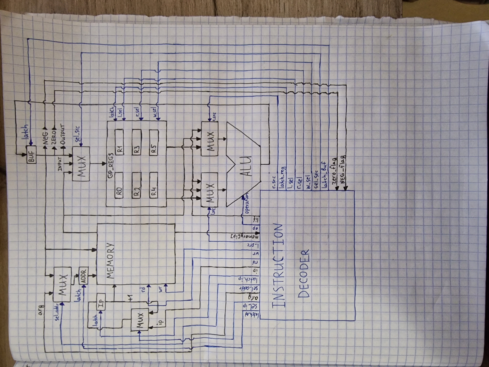

# ASM. Транслятор и модель

- Суховей Ярослав Юрьевич. 312198.
- `asm | risc | neum | hw | tick | struct | stream | port | prob2`


## Язык программирования

- Метки. Если в строке одно слово, начинающееся с "." и заканчивающееся ":", оно считается меткой. Именя меток не могу повторяться. Пример:
```
. . .
.start:                 ; Объявление метки
    rd
    mov %rou %rin
    cmp %rou 0
    je .exit            ; Условный прыжок на метку
    wr
    jmp .start          ; Безусловный прыжок на метку

    .exit:              ; Еще одно объявление метки
        hlt
. . .
```

- Управляющие метки:
    - `.start` - точка входа в программу, является обязательной.
    - `.data` - может быть указана перед меткой .start, указывает на то, что весь код до ближайшей следующей метки является секцией данных, т.е. частью кода, где можно объявляеть переменные.


- Переменные: объявляются после метки .data. Объявление состоит из 2 слов: имени переменной и его значения. Значение может быть только числом, но положить в переменнную можно и символ, если использовать кавычки, в таком случак в переменную будет помещен код этого символа. Пример:
```
. . .
.data:
    int_var 12345
    char_var "A"
. . .
```

- Комментарии: начиная с ";" и до конца строки все считается комментарием. Пример:
```
. . .
    cmp %rou 0
    je .exit            ; Условный прыжок на метку (Комментарий)
    wr
    jmp .start          ; Безусловный прыжок на метку (Комментарий)

;                         Целая строка тоже может быть закомметирована

;   mov %rax %rdi       ; Можно комментировать части кода, они будут проигнорированы

    .exit:              ; Еще одно объявление метки (Комментарий)
. . .
```

- Обращения к регистрам: машина оснащена 6 регистрами общего назначения, и есть несколько способов обращаться к ним. Обращение к регистру всегда начинается с символа "%", чтобы не перепутать его с простой переменной. Подробнее про регистры будет сказано далее":
```
. . .
; Все эти операции эквивалентны, они производятся над одними и теми же регистрами
mov %reg0 %reg5 
mov %rax %rdi
mov %rin %rou
. . .
```

#### Поддерживаемые операции:
- `rd` -> прчитать значение из входного буфера в регистр %rin (%reg0)
- `wr` -> вывести значение (код символа) из выходного регистра %rou (%reg5) в выходной буфер
- `wrn` -> вывести число из выходного регистра %rou (%reg5) в выходной буфер
- `nop` -> ничего не делает, заглушка
- `mov <arg1> <arg2>` -> поместить значение из источника (регистра / переменной / литерала) в точку назначения (регистр / переменную)
- `add <arg1> <arg2>` -> прибавить к значению первого аргумента (регистра / переменной) значение второго аргумента (регистра / переменной / литерала)
- `sub <arg1> <arg2>` -> отнять от значения первого аргумента (регистра / переменной) значение второго аргумента (регистра / переменной / литерала)
- `mul <arg1> <arg2>` -> умножить значение певрого аргумента (регистра / переменной) на значение второго аргумента (регистра / переменной / литерала)
- `div <arg1> <arg2>` -> разделить значение первого аргумента (регистра / переменной) на значение второго аргумента (регистра / переменной / литерала)
- `mod <arg1> <arg2>` -> посчитать остаток от деления значения пеарого аргумента (регистра / переменной) на значение второго аргумента (регистра / переменной / литерала)
- `cmp <arg1> <arg2>` -> сравнить аргументы (регистры / переменные / литералы) и установить флаги 
- `jmp <arg1>` -> перепрыгнуть на метку (переместить IP на адрес метки)
- `jg <arg1>` -> перепрыгнуть на метку, если флаги указывают на результат сравнения ">"
- `jl <arg1>` -> перепрыгнуть на метку, если флаги указывают на результат сравнения "<"
- `je <arg1>` -> перепрыгнуть на метку, если флаги указывают на результат сравнения "="
- `jng <arg1>` -> перепрыгнуть на метку, если флаги указывают на результат сравнения "<="
- `jnl <arg1>` -> перепрыгнуть на метку, если флаги указывают на результат сравнения ">="
- `jne <arg1>` -> перепрыгнуть на метку, если флаги указывают на результат сравнения "!="
- `hlt` -> остановить исполнение

## Организация памяти:
Машинное слово - 32 бита, знаковое. Память реализуется списком словарей, описывающих инструкции / ячейки с данными. Хранится оно по слову в ячейке.

## Система команд
Особенности процессора:
- Машинное слово - 32 бита, знаковое
### Регистры:
- `ip` - счётчик команд:
    - инкрементируется после каждой инструкции или перезаписывается переходом.
- `addr` - адресный регистр:
    - хранит индекс ячейки, в которую можно что-то записать или прочитать
- `buf` - буферный регистр:
    - хранит в себе результат операции
    - в него можно поместить значение любого регистра общего назначения, ячейки памяти или литерала
    - его значение устанавливает флаги
    - его значение может быть передано но вывод
- `%reg0 / %rax / %rin` - регистр общего назначения
    - используется как регситр ввода, данные из буфера ввода попадают туда при вызове соответствующей инструкции
    - может быть использован для хранения данных и арифметических операций
- `%reg1 / %rbx` - регистр общего назначения
    - может быть использован для хранения данных и арифметических операций
- `%reg2 / %rcx` - регистр общего назначения
    - может быть использован для хранения данных и арифметических операций
- `%reg3 / %rdx` - регистр общего назначения
    - может быть использован для хранения данных и арифметических операций
- `%reg4 / %rsi` - регистр общего назначения
    - может быть использован для хранения данных и арифметических операций
- `%reg5 / %rdi / %rou` - регистр общего назначения
    - используется как регситр вывода, данные из него попадают в буферный регистр, а потом в буфер вывода при вызове соответствующей инструкции
    - может быть использован для хранения данных и арифметических операций
### Флаги:
- `zero` - нулевой флаг
- `neg` - отрицательный флаг
### Память:
- Адресуется через регистр `addr`
- Может быть записана с регистра `buf`
- Может быть прочитана в любой регистр общего назначения
- Может передавать значение напрямую на входы АЛУ в качестве операнда (только один операнд может быть взят из памяти за такт т.к. адресный регистр всего один)

### Набор инструкций
В качестве аргумента любой инструкции могут быть переданы:
- Литерал - передается напрямую в АЛУ и нигде не сохраняется
- Переменная - на этапе трансляции вместо нее подставляется адрес в памяти, где она будет расположена
- Метка - на этапе трансляции вместо нее подставляется адрес следующей ячейки в памяти
- Регистр общего назначения - при трансляции все имена регистров заменяются их номерами

| Syntax              | Mnemonic              | Кол-во тактов | Comment                                                                                      |
|:--------------------|:----------------------|---------------|:---------------------------------------------------------------------------------------------|
| `rd`                | rd                    | 1             | Читает в регистр %rin                                                                        |
| `wr`                | wr                    | 2             | Записывает из регистра %rou                                                                  |
| `wrn`               | wrn                   | 2             | Записывает из регистра %rou                                                                  |
| `nop`               | nop                   | 1             | -                                                                                            |
| `mov <arg1> <arg2>` | mov `<arg1>` `<arg2>` | 2             | -                                                                                            |
| `add <arg1> <arg2>` | add `<arg1>` `<arg2>` | 2             | -                                                                                            |
| `sub <arg1> <arg2>` | sub `<arg1>` `<arg2>` | 2             | -                                                                                            |
| `mul <arg1> <arg2>` | mul `<arg1>` `<arg2>` | 2             | -                                                                                            |
| `div <arg1> <arg2>` | div `<arg1>` `<arg2>` | 2             | -                                                                                            |
| `mod <arg1> <arg2>` | mod `<arg1>` `<arg2>` | 2             | -                                                                                            |
| `cmp <arg1> <arg2>` | cmp `<arg1>` `<arg2>` | 2             | Выполняет sub с установкой флагов, но не сохраняет результат никуда кроме буферного регистра |
| `jmp <arg>`         | jmp `<arg>`           | 1             | -                                                                                            |
| `jg <arg>`          | jg `<arg>`            | 1             | -                                                                                            |
| `jl <arg>`          | jl `<arg>`            | 1             | -                                                                                            |
| `je <arg>`          | je `<arg>`            | 1             | -                                                                                            |
| `jng <arg>`         | jng `<arg>`           | 1             | -                                                                                            |
| `jnl <arg>`         | jnl `<arg>`           | 1             | -                                                                                            |
| `jne <arg>`         | jne `<arg>`           | 1             | -                                                                                            |
| `hlt`               | hlt                   | 0             | -                                                                                            |

### Кодирование инструкций

- Машинный код сериализуется в список JSON.
- Один элемент списка - одна инструкция.
- Индекс списка - адрес инструкции. Используется для команд перехода.

Пример:

```json
[
    {
        "opcode": "cmp",
        "term": [
            3,
            5,
            0,
            "register",
            "literal"
        ]
    }
]
```
- `opcode` - строка с кодом операции;
- `term` - информация об инструкции (номер, аргументы, режимы)

Типы данные в модуле [isa](./isa.py), где:
- `Opcode` -- перечисление кодов операций
- `AddrMode` -- перечисление типов адресации
- `Term` -- структура для описания информации об инструкции.

## Транслятор

Интерфейс командной строки: `translator.py <input_file> <target_file>"`

Реализовано в модуле: [translator](./translator.py)

Этапы трансляции (функция `translate`):

1. Из кода удаляются комментарии
2. Проверяется общее количество аргументов команд (не более 2)
3. Текст преобразуется в набор термов, метки и переменные сохраняются отдельно в словарях
3. Имена регистров преобразуюся к стандартному виду (%reg#)
4. Проверяется наличие метки `.start`
5. В термах раскрываются типы адресации, вместо имен переменных и регистров подставляются адреса

Правила генерации машинного кода:
- один терм - одна инструкция
- вместо переменных и регистров подставляются их адреса, а вместо меток - адреса следующих ячеек в памяти

## Модель процессора

Реализовано в модуле: [machine](./machine.py).
На схеме DataPath отделен от ControlUnit цветом.



### DataPath

Реализован в классе `DataPath`.

Сигналы (обрабатываются за один такт, реализованы в виде методов класса):

- `read_l_reg` - получить значение какого-то регистра общего назначение на левой дорожке блока регистров (выполняется за 1 такт одновременно с `read_r_reg`)
- `read_r_reg` - получить значение какого-то регистра общего назначение на правой дорожке блока регистров (выполняется за 1 такт одновременно c `read_l_reg`)
- `latch_reg` - защелкнуть значение регистра общего назначения (номер регистра выбирается через управляющую дорожку w_sel)
- `latch_addr` - защелкнуть значение в `addr`
- `latch_buf` - защёлкнуть значение в `buf`
- `rd` - прочитать значение из памяти по адресу `addr`
- `wr` - записать значение из `buf` в память по адресу `addr`
- `select_left` - выбрать источник левого операнда для передачи в АЛУ
- `select_right` - выбрать источник правого операнда для передачи в АЛУ
- `calculate (operation)` - выбрать операцию для АЛУ

Флаги:
- `flag_zero` - отражает наличие нулевого значения в `buf`
- `flag_neg` - отражает наличие отрицательного значения в `buf`

### ControlUnit
Реализован в классе `ControlUnit`.

- Hardwired (реализовано полностью на python).
- Моделирование на уровне инструкций.
- Трансляция инструкции в последовательность сигналов: `decode_and_execute_instruction`.

Сигналы:
- `latch_ip` - защелкнуть счётчик команд в ControlUnit

Особенности работы модели:

- Для журнала состояний процессора используется стандартный модуль logging
- Размер памяти, выделенной для машины, задается константой, которую можно менять
- Количество инструкций для моделирования ограничено константой, которую можно менять
- Остановка моделирования осуществляется при помощи исключения `StopIteration` (его порождает инструкция `halt`).
- Управление симуляцией реализовано в функции `simulation`.


## Апробация

[Юнит тесты транслятора](./translator_test.py)

[Юнит тесты симулятора](./machine_test.py) 

Тесты транслятора:
1. [hello world](./tests/test_hello).
2. [cat](./tests/test_cat) - программа `cat`, перебрасывание ввода на вывод.
3. [prob2](./tests/test_prob2) - 2 проблема Эйлера из моего варианта.

Пример для `prob2`:

```
.data:
    result 0
    limit 4000000

.start:
    mov %rax 1
    mov %rbx 1

    .loop:
        mov %rcx %rax
        add %rcx %rbx

        mov %rax %rbx
        mov %rbx %rcx

        mod %rcx 2
        cmp %rcx 0
        jne .continue

        add result %rbx

        .continue:
            cmp %rbx limit
            jnl .exit_loop
            jmp .loop

    .exit_loop:
        mov %rou result
        wrn

    hlt
```

```
[
    {
        "opcode": "jmp",
        "term": [
            0,
            3,
            0,
            "pointer",
            "literal"
        ]
    },
    {
        "opcode": "data",
        "term": [
            1,
            0,
            0,
            "literal",
            "literal"
        ]
    },
    {
        "opcode": "data",
        "term": [
            2,
            4000000,
            0,
            "literal",
            "literal"
        ]
    },
    {
        "opcode": "mov",
        "term": [
            3,
            0,
            1,
            "register",
            "literal"
        ]
    },
    {
        "opcode": "mov",
        "term": [
            4,
            1,
            1,
            "register",
            "literal"
        ]
    },
    {
        "opcode": "mov",
        "term": [
            5,
            2,
            0,
            "register",
            "register"
        ]
    },
    {
        "opcode": "add",
        "term": [
            6,
            2,
            1,
            "register",
            "register"
        ]
    },
    {
        "opcode": "mov",
        "term": [
            7,
            0,
            1,
            "register",
            "register"
        ]
    },
    {
        "opcode": "mov",
        "term": [
            8,
            1,
            2,
            "register",
            "register"
        ]
    },
    {
        "opcode": "mod",
        "term": [
            9,
            2,
            2,
            "register",
            "literal"
        ]
    },
    {
        "opcode": "cmp",
        "term": [
            10,
            2,
            0,
            "register",
            "literal"
        ]
    },
    {
        "opcode": "jne",
        "term": [
            11,
            13,
            0,
            "pointer",
            "literal"
        ]
    },
    {
        "opcode": "add",
        "term": [
            12,
            1,
            1,
            "pointer",
            "register"
        ]
    },
    {
        "opcode": "cmp",
        "term": [
            13,
            1,
            2,
            "register",
            "pointer"
        ]
    },
    {
        "opcode": "jnl",
        "term": [
            14,
            16,
            0,
            "pointer",
            "literal"
        ]
    },
    {
        "opcode": "jmp",
        "term": [
            15,
            5,
            0,
            "pointer",
            "literal"
        ]
    },
    {
        "opcode": "mov",
        "term": [
            16,
            5,
            1,
            "register",
            "pointer"
        ]
    },
    {
        "opcode": "wrn",
        "term": [
            17,
            0,
            0,
            "literal",
            "literal"
        ]
    },
    {
        "opcode": "hlt",
        "term": [
            18,
            0,
            0,
            "literal",
            "literal"
        ]
    }
]
```
Другие тесты находятся в папке tests, в отчете они заняли бы слишком много места. 

Тесты симулятора:
1. [hello world](./tests/test_hello).
2. [cat](./tests/test_cat) - программа `cat`, перебрасывание ввода на вывод.
3. [prob2](./tests/test_prob2) - 2 проблема Эйлера из моего варианта.

Вывод при исполнении транслированных инструкций `prob2`:
```
/home/yars/PycharmProjects/virtual_m/venv/bin/python /home/yars/PycharmProjects/virtual_m/machine.py 
DEBUG:root:{TICK: 0, IP: 0, ADDR: 0, BUF: 0, REG0 (RAX): 0, REG1 (RBX): 0, REG2 (RCX): 0, REG3 (RDX): 0, REG4 (RSI): 0, REG5 (RDI): 0, N: False, Z: True}
DEBUG:root:{TICK: 1, IP: 3, ADDR: 0, BUF: 0, REG0 (RAX): 0, REG1 (RBX): 0, REG2 (RCX): 0, REG3 (RDX): 0, REG4 (RSI): 0, REG5 (RDI): 0, N: False, Z: True}
DEBUG:root:{TICK: 3, IP: 4, ADDR: 0, BUF: 1, REG0 (RAX): 1, REG1 (RBX): 0, REG2 (RCX): 0, REG3 (RDX): 0, REG4 (RSI): 0, REG5 (RDI): 0, N: False, Z: False}
DEBUG:root:{TICK: 5, IP: 5, ADDR: 0, BUF: 1, REG0 (RAX): 1, REG1 (RBX): 1, REG2 (RCX): 0, REG3 (RDX): 0, REG4 (RSI): 0, REG5 (RDI): 0, N: False, Z: False}
DEBUG:root:{TICK: 7, IP: 6, ADDR: 0, BUF: 1, REG0 (RAX): 1, REG1 (RBX): 1, REG2 (RCX): 1, REG3 (RDX): 0, REG4 (RSI): 0, REG5 (RDI): 0, N: False, Z: False}
DEBUG:root:{TICK: 9, IP: 7, ADDR: 0, BUF: 2, REG0 (RAX): 1, REG1 (RBX): 1, REG2 (RCX): 2, REG3 (RDX): 0, REG4 (RSI): 0, REG5 (RDI): 0, N: False, Z: False}
DEBUG:root:{TICK: 11, IP: 8, ADDR: 0, BUF: 1, REG0 (RAX): 1, REG1 (RBX): 1, REG2 (RCX): 2, REG3 (RDX): 0, REG4 (RSI): 0, REG5 (RDI): 0, N: False, Z: False}
DEBUG:root:{TICK: 13, IP: 9, ADDR: 0, BUF: 2, REG0 (RAX): 1, REG1 (RBX): 2, REG2 (RCX): 2, REG3 (RDX): 0, REG4 (RSI): 0, REG5 (RDI): 0, N: False, Z: False}
DEBUG:root:{TICK: 15, IP: 10, ADDR: 0, BUF: 0, REG0 (RAX): 1, REG1 (RBX): 2, REG2 (RCX): 0, REG3 (RDX): 0, REG4 (RSI): 0, REG5 (RDI): 0, N: False, Z: True}
DEBUG:root:{TICK: 17, IP: 11, ADDR: 0, BUF: 0, REG0 (RAX): 1, REG1 (RBX): 2, REG2 (RCX): 0, REG3 (RDX): 0, REG4 (RSI): 0, REG5 (RDI): 0, N: False, Z: True}
DEBUG:root:{TICK: 18, IP: 12, ADDR: 0, BUF: 0, REG0 (RAX): 1, REG1 (RBX): 2, REG2 (RCX): 0, REG3 (RDX): 0, REG4 (RSI): 0, REG5 (RDI): 0, N: False, Z: True}
DEBUG:root:{TICK: 20, IP: 13, ADDR: 1, BUF: 2, REG0 (RAX): 1, REG1 (RBX): 2, REG2 (RCX): 0, REG3 (RDX): 0, REG4 (RSI): 0, REG5 (RDI): 0, N: False, Z: False}
DEBUG:root:{TICK: 22, IP: 14, ADDR: 2, BUF: -3999998, REG0 (RAX): 1, REG1 (RBX): 2, REG2 (RCX): 0, REG3 (RDX): 0, REG4 (RSI): 0, REG5 (RDI): 0, N: True, Z: False}
DEBUG:root:{TICK: 23, IP: 15, ADDR: 2, BUF: -3999998, REG0 (RAX): 1, REG1 (RBX): 2, REG2 (RCX): 0, REG3 (RDX): 0, REG4 (RSI): 0, REG5 (RDI): 0, N: True, Z: False}
DEBUG:root:{TICK: 24, IP: 5, ADDR: 2, BUF: -3999998, REG0 (RAX): 1, REG1 (RBX): 2, REG2 (RCX): 0, REG3 (RDX): 0, REG4 (RSI): 0, REG5 (RDI): 0, N: True, Z: False}
DEBUG:root:{TICK: 26, IP: 6, ADDR: 2, BUF: 1, REG0 (RAX): 1, REG1 (RBX): 2, REG2 (RCX): 1, REG3 (RDX): 0, REG4 (RSI): 0, REG5 (RDI): 0, N: False, Z: False}
DEBUG:root:{TICK: 28, IP: 7, ADDR: 2, BUF: 3, REG0 (RAX): 1, REG1 (RBX): 2, REG2 (RCX): 3, REG3 (RDX): 0, REG4 (RSI): 0, REG5 (RDI): 0, N: False, Z: False}
DEBUG:root:{TICK: 30, IP: 8, ADDR: 2, BUF: 2, REG0 (RAX): 2, REG1 (RBX): 2, REG2 (RCX): 3, REG3 (RDX): 0, REG4 (RSI): 0, REG5 (RDI): 0, N: False, Z: False}
DEBUG:root:{TICK: 32, IP: 9, ADDR: 2, BUF: 3, REG0 (RAX): 2, REG1 (RBX): 3, REG2 (RCX): 3, REG3 (RDX): 0, REG4 (RSI): 0, REG5 (RDI): 0, N: False, Z: False}
DEBUG:root:{TICK: 34, IP: 10, ADDR: 2, BUF: 1, REG0 (RAX): 2, REG1 (RBX): 3, REG2 (RCX): 1, REG3 (RDX): 0, REG4 (RSI): 0, REG5 (RDI): 0, N: False, Z: False}
DEBUG:root:{TICK: 36, IP: 11, ADDR: 2, BUF: 1, REG0 (RAX): 2, REG1 (RBX): 3, REG2 (RCX): 1, REG3 (RDX): 0, REG4 (RSI): 0, REG5 (RDI): 0, N: False, Z: False}
DEBUG:root:{TICK: 37, IP: 13, ADDR: 2, BUF: 1, REG0 (RAX): 2, REG1 (RBX): 3, REG2 (RCX): 1, REG3 (RDX): 0, REG4 (RSI): 0, REG5 (RDI): 0, N: False, Z: False}
DEBUG:root:{TICK: 39, IP: 14, ADDR: 2, BUF: -3999997, REG0 (RAX): 2, REG1 (RBX): 3, REG2 (RCX): 1, REG3 (RDX): 0, REG4 (RSI): 0, REG5 (RDI): 0, N: True, Z: False}
DEBUG:root:{TICK: 40, IP: 15, ADDR: 2, BUF: -3999997, REG0 (RAX): 2, REG1 (RBX): 3, REG2 (RCX): 1, REG3 (RDX): 0, REG4 (RSI): 0, REG5 (RDI): 0, N: True, Z: False}
DEBUG:root:{TICK: 41, IP: 5, ADDR: 2, BUF: -3999997, REG0 (RAX): 2, REG1 (RBX): 3, REG2 (RCX): 1, REG3 (RDX): 0, REG4 (RSI): 0, REG5 (RDI): 0, N: True, Z: False}
DEBUG:root:{TICK: 43, IP: 6, ADDR: 2, BUF: 2, REG0 (RAX): 2, REG1 (RBX): 3, REG2 (RCX): 2, REG3 (RDX): 0, REG4 (RSI): 0, REG5 (RDI): 0, N: False, Z: False}
DEBUG:root:{TICK: 45, IP: 7, ADDR: 2, BUF: 5, REG0 (RAX): 2, REG1 (RBX): 3, REG2 (RCX): 5, REG3 (RDX): 0, REG4 (RSI): 0, REG5 (RDI): 0, N: False, Z: False}
DEBUG:root:{TICK: 47, IP: 8, ADDR: 2, BUF: 3, REG0 (RAX): 3, REG1 (RBX): 3, REG2 (RCX): 5, REG3 (RDX): 0, REG4 (RSI): 0, REG5 (RDI): 0, N: False, Z: False}
DEBUG:root:{TICK: 49, IP: 9, ADDR: 2, BUF: 5, REG0 (RAX): 3, REG1 (RBX): 5, REG2 (RCX): 5, REG3 (RDX): 0, REG4 (RSI): 0, REG5 (RDI): 0, N: False, Z: False}
DEBUG:root:{TICK: 51, IP: 10, ADDR: 2, BUF: 1, REG0 (RAX): 3, REG1 (RBX): 5, REG2 (RCX): 1, REG3 (RDX): 0, REG4 (RSI): 0, REG5 (RDI): 0, N: False, Z: False}
DEBUG:root:{TICK: 53, IP: 11, ADDR: 2, BUF: 1, REG0 (RAX): 3, REG1 (RBX): 5, REG2 (RCX): 1, REG3 (RDX): 0, REG4 (RSI): 0, REG5 (RDI): 0, N: False, Z: False}
DEBUG:root:{TICK: 54, IP: 13, ADDR: 2, BUF: 1, REG0 (RAX): 3, REG1 (RBX): 5, REG2 (RCX): 1, REG3 (RDX): 0, REG4 (RSI): 0, REG5 (RDI): 0, N: False, Z: False}
DEBUG:root:{TICK: 56, IP: 14, ADDR: 2, BUF: -3999995, REG0 (RAX): 3, REG1 (RBX): 5, REG2 (RCX): 1, REG3 (RDX): 0, REG4 (RSI): 0, REG5 (RDI): 0, N: True, Z: False}
DEBUG:root:{TICK: 57, IP: 15, ADDR: 2, BUF: -3999995, REG0 (RAX): 3, REG1 (RBX): 5, REG2 (RCX): 1, REG3 (RDX): 0, REG4 (RSI): 0, REG5 (RDI): 0, N: True, Z: False}
DEBUG:root:{TICK: 58, IP: 5, ADDR: 2, BUF: -3999995, REG0 (RAX): 3, REG1 (RBX): 5, REG2 (RCX): 1, REG3 (RDX): 0, REG4 (RSI): 0, REG5 (RDI): 0, N: True, Z: False}
DEBUG:root:{TICK: 60, IP: 6, ADDR: 2, BUF: 3, REG0 (RAX): 3, REG1 (RBX): 5, REG2 (RCX): 3, REG3 (RDX): 0, REG4 (RSI): 0, REG5 (RDI): 0, N: False, Z: False}
DEBUG:root:{TICK: 62, IP: 7, ADDR: 2, BUF: 8, REG0 (RAX): 3, REG1 (RBX): 5, REG2 (RCX): 8, REG3 (RDX): 0, REG4 (RSI): 0, REG5 (RDI): 0, N: False, Z: False}
DEBUG:root:{TICK: 64, IP: 8, ADDR: 2, BUF: 5, REG0 (RAX): 5, REG1 (RBX): 5, REG2 (RCX): 8, REG3 (RDX): 0, REG4 (RSI): 0, REG5 (RDI): 0, N: False, Z: False}
DEBUG:root:{TICK: 66, IP: 9, ADDR: 2, BUF: 8, REG0 (RAX): 5, REG1 (RBX): 8, REG2 (RCX): 8, REG3 (RDX): 0, REG4 (RSI): 0, REG5 (RDI): 0, N: False, Z: False}
DEBUG:root:{TICK: 68, IP: 10, ADDR: 2, BUF: 0, REG0 (RAX): 5, REG1 (RBX): 8, REG2 (RCX): 0, REG3 (RDX): 0, REG4 (RSI): 0, REG5 (RDI): 0, N: False, Z: True}
DEBUG:root:{TICK: 70, IP: 11, ADDR: 2, BUF: 0, REG0 (RAX): 5, REG1 (RBX): 8, REG2 (RCX): 0, REG3 (RDX): 0, REG4 (RSI): 0, REG5 (RDI): 0, N: False, Z: True}
DEBUG:root:{TICK: 71, IP: 12, ADDR: 2, BUF: 0, REG0 (RAX): 5, REG1 (RBX): 8, REG2 (RCX): 0, REG3 (RDX): 0, REG4 (RSI): 0, REG5 (RDI): 0, N: False, Z: True}
DEBUG:root:{TICK: 73, IP: 13, ADDR: 1, BUF: 10, REG0 (RAX): 5, REG1 (RBX): 8, REG2 (RCX): 0, REG3 (RDX): 0, REG4 (RSI): 0, REG5 (RDI): 0, N: False, Z: False}
DEBUG:root:{TICK: 75, IP: 14, ADDR: 2, BUF: -3999992, REG0 (RAX): 5, REG1 (RBX): 8, REG2 (RCX): 0, REG3 (RDX): 0, REG4 (RSI): 0, REG5 (RDI): 0, N: True, Z: False}
DEBUG:root:{TICK: 76, IP: 15, ADDR: 2, BUF: -3999992, REG0 (RAX): 5, REG1 (RBX): 8, REG2 (RCX): 0, REG3 (RDX): 0, REG4 (RSI): 0, REG5 (RDI): 0, N: True, Z: False}
DEBUG:root:{TICK: 77, IP: 5, ADDR: 2, BUF: -3999992, REG0 (RAX): 5, REG1 (RBX): 8, REG2 (RCX): 0, REG3 (RDX): 0, REG4 (RSI): 0, REG5 (RDI): 0, N: True, Z: False}
DEBUG:root:{TICK: 79, IP: 6, ADDR: 2, BUF: 5, REG0 (RAX): 5, REG1 (RBX): 8, REG2 (RCX): 5, REG3 (RDX): 0, REG4 (RSI): 0, REG5 (RDI): 0, N: False, Z: False}
DEBUG:root:{TICK: 81, IP: 7, ADDR: 2, BUF: 13, REG0 (RAX): 5, REG1 (RBX): 8, REG2 (RCX): 13, REG3 (RDX): 0, REG4 (RSI): 0, REG5 (RDI): 0, N: False, Z: False}
DEBUG:root:{TICK: 83, IP: 8, ADDR: 2, BUF: 8, REG0 (RAX): 8, REG1 (RBX): 8, REG2 (RCX): 13, REG3 (RDX): 0, REG4 (RSI): 0, REG5 (RDI): 0, N: False, Z: False}
DEBUG:root:{TICK: 85, IP: 9, ADDR: 2, BUF: 13, REG0 (RAX): 8, REG1 (RBX): 13, REG2 (RCX): 13, REG3 (RDX): 0, REG4 (RSI): 0, REG5 (RDI): 0, N: False, Z: False}
DEBUG:root:{TICK: 87, IP: 10, ADDR: 2, BUF: 1, REG0 (RAX): 8, REG1 (RBX): 13, REG2 (RCX): 1, REG3 (RDX): 0, REG4 (RSI): 0, REG5 (RDI): 0, N: False, Z: False}
DEBUG:root:{TICK: 89, IP: 11, ADDR: 2, BUF: 1, REG0 (RAX): 8, REG1 (RBX): 13, REG2 (RCX): 1, REG3 (RDX): 0, REG4 (RSI): 0, REG5 (RDI): 0, N: False, Z: False}
DEBUG:root:{TICK: 90, IP: 13, ADDR: 2, BUF: 1, REG0 (RAX): 8, REG1 (RBX): 13, REG2 (RCX): 1, REG3 (RDX): 0, REG4 (RSI): 0, REG5 (RDI): 0, N: False, Z: False}
DEBUG:root:{TICK: 92, IP: 14, ADDR: 2, BUF: -3999987, REG0 (RAX): 8, REG1 (RBX): 13, REG2 (RCX): 1, REG3 (RDX): 0, REG4 (RSI): 0, REG5 (RDI): 0, N: True, Z: False}
DEBUG:root:{TICK: 93, IP: 15, ADDR: 2, BUF: -3999987, REG0 (RAX): 8, REG1 (RBX): 13, REG2 (RCX): 1, REG3 (RDX): 0, REG4 (RSI): 0, REG5 (RDI): 0, N: True, Z: False}
DEBUG:root:{TICK: 94, IP: 5, ADDR: 2, BUF: -3999987, REG0 (RAX): 8, REG1 (RBX): 13, REG2 (RCX): 1, REG3 (RDX): 0, REG4 (RSI): 0, REG5 (RDI): 0, N: True, Z: False}
DEBUG:root:{TICK: 96, IP: 6, ADDR: 2, BUF: 8, REG0 (RAX): 8, REG1 (RBX): 13, REG2 (RCX): 8, REG3 (RDX): 0, REG4 (RSI): 0, REG5 (RDI): 0, N: False, Z: False}
DEBUG:root:{TICK: 98, IP: 7, ADDR: 2, BUF: 21, REG0 (RAX): 8, REG1 (RBX): 13, REG2 (RCX): 21, REG3 (RDX): 0, REG4 (RSI): 0, REG5 (RDI): 0, N: False, Z: False}
DEBUG:root:{TICK: 100, IP: 8, ADDR: 2, BUF: 13, REG0 (RAX): 13, REG1 (RBX): 13, REG2 (RCX): 21, REG3 (RDX): 0, REG4 (RSI): 0, REG5 (RDI): 0, N: False, Z: False}
DEBUG:root:{TICK: 102, IP: 9, ADDR: 2, BUF: 21, REG0 (RAX): 13, REG1 (RBX): 21, REG2 (RCX): 21, REG3 (RDX): 0, REG4 (RSI): 0, REG5 (RDI): 0, N: False, Z: False}
DEBUG:root:{TICK: 104, IP: 10, ADDR: 2, BUF: 1, REG0 (RAX): 13, REG1 (RBX): 21, REG2 (RCX): 1, REG3 (RDX): 0, REG4 (RSI): 0, REG5 (RDI): 0, N: False, Z: False}
DEBUG:root:{TICK: 106, IP: 11, ADDR: 2, BUF: 1, REG0 (RAX): 13, REG1 (RBX): 21, REG2 (RCX): 1, REG3 (RDX): 0, REG4 (RSI): 0, REG5 (RDI): 0, N: False, Z: False}
DEBUG:root:{TICK: 107, IP: 13, ADDR: 2, BUF: 1, REG0 (RAX): 13, REG1 (RBX): 21, REG2 (RCX): 1, REG3 (RDX): 0, REG4 (RSI): 0, REG5 (RDI): 0, N: False, Z: False}
DEBUG:root:{TICK: 109, IP: 14, ADDR: 2, BUF: -3999979, REG0 (RAX): 13, REG1 (RBX): 21, REG2 (RCX): 1, REG3 (RDX): 0, REG4 (RSI): 0, REG5 (RDI): 0, N: True, Z: False}
DEBUG:root:{TICK: 110, IP: 15, ADDR: 2, BUF: -3999979, REG0 (RAX): 13, REG1 (RBX): 21, REG2 (RCX): 1, REG3 (RDX): 0, REG4 (RSI): 0, REG5 (RDI): 0, N: True, Z: False}
DEBUG:root:{TICK: 111, IP: 5, ADDR: 2, BUF: -3999979, REG0 (RAX): 13, REG1 (RBX): 21, REG2 (RCX): 1, REG3 (RDX): 0, REG4 (RSI): 0, REG5 (RDI): 0, N: True, Z: False}
DEBUG:root:{TICK: 113, IP: 6, ADDR: 2, BUF: 13, REG0 (RAX): 13, REG1 (RBX): 21, REG2 (RCX): 13, REG3 (RDX): 0, REG4 (RSI): 0, REG5 (RDI): 0, N: False, Z: False}
DEBUG:root:{TICK: 115, IP: 7, ADDR: 2, BUF: 34, REG0 (RAX): 13, REG1 (RBX): 21, REG2 (RCX): 34, REG3 (RDX): 0, REG4 (RSI): 0, REG5 (RDI): 0, N: False, Z: False}
DEBUG:root:{TICK: 117, IP: 8, ADDR: 2, BUF: 21, REG0 (RAX): 21, REG1 (RBX): 21, REG2 (RCX): 34, REG3 (RDX): 0, REG4 (RSI): 0, REG5 (RDI): 0, N: False, Z: False}
DEBUG:root:{TICK: 119, IP: 9, ADDR: 2, BUF: 34, REG0 (RAX): 21, REG1 (RBX): 34, REG2 (RCX): 34, REG3 (RDX): 0, REG4 (RSI): 0, REG5 (RDI): 0, N: False, Z: False}
DEBUG:root:{TICK: 121, IP: 10, ADDR: 2, BUF: 0, REG0 (RAX): 21, REG1 (RBX): 34, REG2 (RCX): 0, REG3 (RDX): 0, REG4 (RSI): 0, REG5 (RDI): 0, N: False, Z: True}
DEBUG:root:{TICK: 123, IP: 11, ADDR: 2, BUF: 0, REG0 (RAX): 21, REG1 (RBX): 34, REG2 (RCX): 0, REG3 (RDX): 0, REG4 (RSI): 0, REG5 (RDI): 0, N: False, Z: True}
DEBUG:root:{TICK: 124, IP: 12, ADDR: 2, BUF: 0, REG0 (RAX): 21, REG1 (RBX): 34, REG2 (RCX): 0, REG3 (RDX): 0, REG4 (RSI): 0, REG5 (RDI): 0, N: False, Z: True}
DEBUG:root:{TICK: 126, IP: 13, ADDR: 1, BUF: 44, REG0 (RAX): 21, REG1 (RBX): 34, REG2 (RCX): 0, REG3 (RDX): 0, REG4 (RSI): 0, REG5 (RDI): 0, N: False, Z: False}
DEBUG:root:{TICK: 128, IP: 14, ADDR: 2, BUF: -3999966, REG0 (RAX): 21, REG1 (RBX): 34, REG2 (RCX): 0, REG3 (RDX): 0, REG4 (RSI): 0, REG5 (RDI): 0, N: True, Z: False}
DEBUG:root:{TICK: 129, IP: 15, ADDR: 2, BUF: -3999966, REG0 (RAX): 21, REG1 (RBX): 34, REG2 (RCX): 0, REG3 (RDX): 0, REG4 (RSI): 0, REG5 (RDI): 0, N: True, Z: False}
DEBUG:root:{TICK: 130, IP: 5, ADDR: 2, BUF: -3999966, REG0 (RAX): 21, REG1 (RBX): 34, REG2 (RCX): 0, REG3 (RDX): 0, REG4 (RSI): 0, REG5 (RDI): 0, N: True, Z: False}
DEBUG:root:{TICK: 132, IP: 6, ADDR: 2, BUF: 21, REG0 (RAX): 21, REG1 (RBX): 34, REG2 (RCX): 21, REG3 (RDX): 0, REG4 (RSI): 0, REG5 (RDI): 0, N: False, Z: False}
DEBUG:root:{TICK: 134, IP: 7, ADDR: 2, BUF: 55, REG0 (RAX): 21, REG1 (RBX): 34, REG2 (RCX): 55, REG3 (RDX): 0, REG4 (RSI): 0, REG5 (RDI): 0, N: False, Z: False}
DEBUG:root:{TICK: 136, IP: 8, ADDR: 2, BUF: 34, REG0 (RAX): 34, REG1 (RBX): 34, REG2 (RCX): 55, REG3 (RDX): 0, REG4 (RSI): 0, REG5 (RDI): 0, N: False, Z: False}
DEBUG:root:{TICK: 138, IP: 9, ADDR: 2, BUF: 55, REG0 (RAX): 34, REG1 (RBX): 55, REG2 (RCX): 55, REG3 (RDX): 0, REG4 (RSI): 0, REG5 (RDI): 0, N: False, Z: False}
DEBUG:root:{TICK: 140, IP: 10, ADDR: 2, BUF: 1, REG0 (RAX): 34, REG1 (RBX): 55, REG2 (RCX): 1, REG3 (RDX): 0, REG4 (RSI): 0, REG5 (RDI): 0, N: False, Z: False}
DEBUG:root:{TICK: 142, IP: 11, ADDR: 2, BUF: 1, REG0 (RAX): 34, REG1 (RBX): 55, REG2 (RCX): 1, REG3 (RDX): 0, REG4 (RSI): 0, REG5 (RDI): 0, N: False, Z: False}
DEBUG:root:{TICK: 143, IP: 13, ADDR: 2, BUF: 1, REG0 (RAX): 34, REG1 (RBX): 55, REG2 (RCX): 1, REG3 (RDX): 0, REG4 (RSI): 0, REG5 (RDI): 0, N: False, Z: False}
DEBUG:root:{TICK: 145, IP: 14, ADDR: 2, BUF: -3999945, REG0 (RAX): 34, REG1 (RBX): 55, REG2 (RCX): 1, REG3 (RDX): 0, REG4 (RSI): 0, REG5 (RDI): 0, N: True, Z: False}
DEBUG:root:{TICK: 146, IP: 15, ADDR: 2, BUF: -3999945, REG0 (RAX): 34, REG1 (RBX): 55, REG2 (RCX): 1, REG3 (RDX): 0, REG4 (RSI): 0, REG5 (RDI): 0, N: True, Z: False}
DEBUG:root:{TICK: 147, IP: 5, ADDR: 2, BUF: -3999945, REG0 (RAX): 34, REG1 (RBX): 55, REG2 (RCX): 1, REG3 (RDX): 0, REG4 (RSI): 0, REG5 (RDI): 0, N: True, Z: False}
DEBUG:root:{TICK: 149, IP: 6, ADDR: 2, BUF: 34, REG0 (RAX): 34, REG1 (RBX): 55, REG2 (RCX): 34, REG3 (RDX): 0, REG4 (RSI): 0, REG5 (RDI): 0, N: False, Z: False}
DEBUG:root:{TICK: 151, IP: 7, ADDR: 2, BUF: 89, REG0 (RAX): 34, REG1 (RBX): 55, REG2 (RCX): 89, REG3 (RDX): 0, REG4 (RSI): 0, REG5 (RDI): 0, N: False, Z: False}
DEBUG:root:{TICK: 153, IP: 8, ADDR: 2, BUF: 55, REG0 (RAX): 55, REG1 (RBX): 55, REG2 (RCX): 89, REG3 (RDX): 0, REG4 (RSI): 0, REG5 (RDI): 0, N: False, Z: False}
DEBUG:root:{TICK: 155, IP: 9, ADDR: 2, BUF: 89, REG0 (RAX): 55, REG1 (RBX): 89, REG2 (RCX): 89, REG3 (RDX): 0, REG4 (RSI): 0, REG5 (RDI): 0, N: False, Z: False}
DEBUG:root:{TICK: 157, IP: 10, ADDR: 2, BUF: 1, REG0 (RAX): 55, REG1 (RBX): 89, REG2 (RCX): 1, REG3 (RDX): 0, REG4 (RSI): 0, REG5 (RDI): 0, N: False, Z: False}
DEBUG:root:{TICK: 159, IP: 11, ADDR: 2, BUF: 1, REG0 (RAX): 55, REG1 (RBX): 89, REG2 (RCX): 1, REG3 (RDX): 0, REG4 (RSI): 0, REG5 (RDI): 0, N: False, Z: False}
DEBUG:root:{TICK: 160, IP: 13, ADDR: 2, BUF: 1, REG0 (RAX): 55, REG1 (RBX): 89, REG2 (RCX): 1, REG3 (RDX): 0, REG4 (RSI): 0, REG5 (RDI): 0, N: False, Z: False}
DEBUG:root:{TICK: 162, IP: 14, ADDR: 2, BUF: -3999911, REG0 (RAX): 55, REG1 (RBX): 89, REG2 (RCX): 1, REG3 (RDX): 0, REG4 (RSI): 0, REG5 (RDI): 0, N: True, Z: False}
DEBUG:root:{TICK: 163, IP: 15, ADDR: 2, BUF: -3999911, REG0 (RAX): 55, REG1 (RBX): 89, REG2 (RCX): 1, REG3 (RDX): 0, REG4 (RSI): 0, REG5 (RDI): 0, N: True, Z: False}
DEBUG:root:{TICK: 164, IP: 5, ADDR: 2, BUF: -3999911, REG0 (RAX): 55, REG1 (RBX): 89, REG2 (RCX): 1, REG3 (RDX): 0, REG4 (RSI): 0, REG5 (RDI): 0, N: True, Z: False}
DEBUG:root:{TICK: 166, IP: 6, ADDR: 2, BUF: 55, REG0 (RAX): 55, REG1 (RBX): 89, REG2 (RCX): 55, REG3 (RDX): 0, REG4 (RSI): 0, REG5 (RDI): 0, N: False, Z: False}
DEBUG:root:{TICK: 168, IP: 7, ADDR: 2, BUF: 144, REG0 (RAX): 55, REG1 (RBX): 89, REG2 (RCX): 144, REG3 (RDX): 0, REG4 (RSI): 0, REG5 (RDI): 0, N: False, Z: False}
DEBUG:root:{TICK: 170, IP: 8, ADDR: 2, BUF: 89, REG0 (RAX): 89, REG1 (RBX): 89, REG2 (RCX): 144, REG3 (RDX): 0, REG4 (RSI): 0, REG5 (RDI): 0, N: False, Z: False}
DEBUG:root:{TICK: 172, IP: 9, ADDR: 2, BUF: 144, REG0 (RAX): 89, REG1 (RBX): 144, REG2 (RCX): 144, REG3 (RDX): 0, REG4 (RSI): 0, REG5 (RDI): 0, N: False, Z: False}
DEBUG:root:{TICK: 174, IP: 10, ADDR: 2, BUF: 0, REG0 (RAX): 89, REG1 (RBX): 144, REG2 (RCX): 0, REG3 (RDX): 0, REG4 (RSI): 0, REG5 (RDI): 0, N: False, Z: True}
DEBUG:root:{TICK: 176, IP: 11, ADDR: 2, BUF: 0, REG0 (RAX): 89, REG1 (RBX): 144, REG2 (RCX): 0, REG3 (RDX): 0, REG4 (RSI): 0, REG5 (RDI): 0, N: False, Z: True}
DEBUG:root:{TICK: 177, IP: 12, ADDR: 2, BUF: 0, REG0 (RAX): 89, REG1 (RBX): 144, REG2 (RCX): 0, REG3 (RDX): 0, REG4 (RSI): 0, REG5 (RDI): 0, N: False, Z: True}
DEBUG:root:{TICK: 179, IP: 13, ADDR: 1, BUF: 188, REG0 (RAX): 89, REG1 (RBX): 144, REG2 (RCX): 0, REG3 (RDX): 0, REG4 (RSI): 0, REG5 (RDI): 0, N: False, Z: False}
DEBUG:root:{TICK: 181, IP: 14, ADDR: 2, BUF: -3999856, REG0 (RAX): 89, REG1 (RBX): 144, REG2 (RCX): 0, REG3 (RDX): 0, REG4 (RSI): 0, REG5 (RDI): 0, N: True, Z: False}
DEBUG:root:{TICK: 182, IP: 15, ADDR: 2, BUF: -3999856, REG0 (RAX): 89, REG1 (RBX): 144, REG2 (RCX): 0, REG3 (RDX): 0, REG4 (RSI): 0, REG5 (RDI): 0, N: True, Z: False}
DEBUG:root:{TICK: 183, IP: 5, ADDR: 2, BUF: -3999856, REG0 (RAX): 89, REG1 (RBX): 144, REG2 (RCX): 0, REG3 (RDX): 0, REG4 (RSI): 0, REG5 (RDI): 0, N: True, Z: False}
DEBUG:root:{TICK: 185, IP: 6, ADDR: 2, BUF: 89, REG0 (RAX): 89, REG1 (RBX): 144, REG2 (RCX): 89, REG3 (RDX): 0, REG4 (RSI): 0, REG5 (RDI): 0, N: False, Z: False}
DEBUG:root:{TICK: 187, IP: 7, ADDR: 2, BUF: 233, REG0 (RAX): 89, REG1 (RBX): 144, REG2 (RCX): 233, REG3 (RDX): 0, REG4 (RSI): 0, REG5 (RDI): 0, N: False, Z: False}
DEBUG:root:{TICK: 189, IP: 8, ADDR: 2, BUF: 144, REG0 (RAX): 144, REG1 (RBX): 144, REG2 (RCX): 233, REG3 (RDX): 0, REG4 (RSI): 0, REG5 (RDI): 0, N: False, Z: False}
DEBUG:root:{TICK: 191, IP: 9, ADDR: 2, BUF: 233, REG0 (RAX): 144, REG1 (RBX): 233, REG2 (RCX): 233, REG3 (RDX): 0, REG4 (RSI): 0, REG5 (RDI): 0, N: False, Z: False}
DEBUG:root:{TICK: 193, IP: 10, ADDR: 2, BUF: 1, REG0 (RAX): 144, REG1 (RBX): 233, REG2 (RCX): 1, REG3 (RDX): 0, REG4 (RSI): 0, REG5 (RDI): 0, N: False, Z: False}
DEBUG:root:{TICK: 195, IP: 11, ADDR: 2, BUF: 1, REG0 (RAX): 144, REG1 (RBX): 233, REG2 (RCX): 1, REG3 (RDX): 0, REG4 (RSI): 0, REG5 (RDI): 0, N: False, Z: False}
DEBUG:root:{TICK: 196, IP: 13, ADDR: 2, BUF: 1, REG0 (RAX): 144, REG1 (RBX): 233, REG2 (RCX): 1, REG3 (RDX): 0, REG4 (RSI): 0, REG5 (RDI): 0, N: False, Z: False}
DEBUG:root:{TICK: 198, IP: 14, ADDR: 2, BUF: -3999767, REG0 (RAX): 144, REG1 (RBX): 233, REG2 (RCX): 1, REG3 (RDX): 0, REG4 (RSI): 0, REG5 (RDI): 0, N: True, Z: False}
DEBUG:root:{TICK: 199, IP: 15, ADDR: 2, BUF: -3999767, REG0 (RAX): 144, REG1 (RBX): 233, REG2 (RCX): 1, REG3 (RDX): 0, REG4 (RSI): 0, REG5 (RDI): 0, N: True, Z: False}
DEBUG:root:{TICK: 200, IP: 5, ADDR: 2, BUF: -3999767, REG0 (RAX): 144, REG1 (RBX): 233, REG2 (RCX): 1, REG3 (RDX): 0, REG4 (RSI): 0, REG5 (RDI): 0, N: True, Z: False}
DEBUG:root:{TICK: 202, IP: 6, ADDR: 2, BUF: 144, REG0 (RAX): 144, REG1 (RBX): 233, REG2 (RCX): 144, REG3 (RDX): 0, REG4 (RSI): 0, REG5 (RDI): 0, N: False, Z: False}
DEBUG:root:{TICK: 204, IP: 7, ADDR: 2, BUF: 377, REG0 (RAX): 144, REG1 (RBX): 233, REG2 (RCX): 377, REG3 (RDX): 0, REG4 (RSI): 0, REG5 (RDI): 0, N: False, Z: False}
DEBUG:root:{TICK: 206, IP: 8, ADDR: 2, BUF: 233, REG0 (RAX): 233, REG1 (RBX): 233, REG2 (RCX): 377, REG3 (RDX): 0, REG4 (RSI): 0, REG5 (RDI): 0, N: False, Z: False}
DEBUG:root:{TICK: 208, IP: 9, ADDR: 2, BUF: 377, REG0 (RAX): 233, REG1 (RBX): 377, REG2 (RCX): 377, REG3 (RDX): 0, REG4 (RSI): 0, REG5 (RDI): 0, N: False, Z: False}
DEBUG:root:{TICK: 210, IP: 10, ADDR: 2, BUF: 1, REG0 (RAX): 233, REG1 (RBX): 377, REG2 (RCX): 1, REG3 (RDX): 0, REG4 (RSI): 0, REG5 (RDI): 0, N: False, Z: False}
DEBUG:root:{TICK: 212, IP: 11, ADDR: 2, BUF: 1, REG0 (RAX): 233, REG1 (RBX): 377, REG2 (RCX): 1, REG3 (RDX): 0, REG4 (RSI): 0, REG5 (RDI): 0, N: False, Z: False}
DEBUG:root:{TICK: 213, IP: 13, ADDR: 2, BUF: 1, REG0 (RAX): 233, REG1 (RBX): 377, REG2 (RCX): 1, REG3 (RDX): 0, REG4 (RSI): 0, REG5 (RDI): 0, N: False, Z: False}
DEBUG:root:{TICK: 215, IP: 14, ADDR: 2, BUF: -3999623, REG0 (RAX): 233, REG1 (RBX): 377, REG2 (RCX): 1, REG3 (RDX): 0, REG4 (RSI): 0, REG5 (RDI): 0, N: True, Z: False}
DEBUG:root:{TICK: 216, IP: 15, ADDR: 2, BUF: -3999623, REG0 (RAX): 233, REG1 (RBX): 377, REG2 (RCX): 1, REG3 (RDX): 0, REG4 (RSI): 0, REG5 (RDI): 0, N: True, Z: False}
DEBUG:root:{TICK: 217, IP: 5, ADDR: 2, BUF: -3999623, REG0 (RAX): 233, REG1 (RBX): 377, REG2 (RCX): 1, REG3 (RDX): 0, REG4 (RSI): 0, REG5 (RDI): 0, N: True, Z: False}
DEBUG:root:{TICK: 219, IP: 6, ADDR: 2, BUF: 233, REG0 (RAX): 233, REG1 (RBX): 377, REG2 (RCX): 233, REG3 (RDX): 0, REG4 (RSI): 0, REG5 (RDI): 0, N: False, Z: False}
DEBUG:root:{TICK: 221, IP: 7, ADDR: 2, BUF: 610, REG0 (RAX): 233, REG1 (RBX): 377, REG2 (RCX): 610, REG3 (RDX): 0, REG4 (RSI): 0, REG5 (RDI): 0, N: False, Z: False}
DEBUG:root:{TICK: 223, IP: 8, ADDR: 2, BUF: 377, REG0 (RAX): 377, REG1 (RBX): 377, REG2 (RCX): 610, REG3 (RDX): 0, REG4 (RSI): 0, REG5 (RDI): 0, N: False, Z: False}
DEBUG:root:{TICK: 225, IP: 9, ADDR: 2, BUF: 610, REG0 (RAX): 377, REG1 (RBX): 610, REG2 (RCX): 610, REG3 (RDX): 0, REG4 (RSI): 0, REG5 (RDI): 0, N: False, Z: False}
DEBUG:root:{TICK: 227, IP: 10, ADDR: 2, BUF: 0, REG0 (RAX): 377, REG1 (RBX): 610, REG2 (RCX): 0, REG3 (RDX): 0, REG4 (RSI): 0, REG5 (RDI): 0, N: False, Z: True}
DEBUG:root:{TICK: 229, IP: 11, ADDR: 2, BUF: 0, REG0 (RAX): 377, REG1 (RBX): 610, REG2 (RCX): 0, REG3 (RDX): 0, REG4 (RSI): 0, REG5 (RDI): 0, N: False, Z: True}
DEBUG:root:{TICK: 230, IP: 12, ADDR: 2, BUF: 0, REG0 (RAX): 377, REG1 (RBX): 610, REG2 (RCX): 0, REG3 (RDX): 0, REG4 (RSI): 0, REG5 (RDI): 0, N: False, Z: True}
DEBUG:root:{TICK: 232, IP: 13, ADDR: 1, BUF: 798, REG0 (RAX): 377, REG1 (RBX): 610, REG2 (RCX): 0, REG3 (RDX): 0, REG4 (RSI): 0, REG5 (RDI): 0, N: False, Z: False}
DEBUG:root:{TICK: 234, IP: 14, ADDR: 2, BUF: -3999390, REG0 (RAX): 377, REG1 (RBX): 610, REG2 (RCX): 0, REG3 (RDX): 0, REG4 (RSI): 0, REG5 (RDI): 0, N: True, Z: False}
DEBUG:root:{TICK: 235, IP: 15, ADDR: 2, BUF: -3999390, REG0 (RAX): 377, REG1 (RBX): 610, REG2 (RCX): 0, REG3 (RDX): 0, REG4 (RSI): 0, REG5 (RDI): 0, N: True, Z: False}
DEBUG:root:{TICK: 236, IP: 5, ADDR: 2, BUF: -3999390, REG0 (RAX): 377, REG1 (RBX): 610, REG2 (RCX): 0, REG3 (RDX): 0, REG4 (RSI): 0, REG5 (RDI): 0, N: True, Z: False}
DEBUG:root:{TICK: 238, IP: 6, ADDR: 2, BUF: 377, REG0 (RAX): 377, REG1 (RBX): 610, REG2 (RCX): 377, REG3 (RDX): 0, REG4 (RSI): 0, REG5 (RDI): 0, N: False, Z: False}
DEBUG:root:{TICK: 240, IP: 7, ADDR: 2, BUF: 987, REG0 (RAX): 377, REG1 (RBX): 610, REG2 (RCX): 987, REG3 (RDX): 0, REG4 (RSI): 0, REG5 (RDI): 0, N: False, Z: False}
DEBUG:root:{TICK: 242, IP: 8, ADDR: 2, BUF: 610, REG0 (RAX): 610, REG1 (RBX): 610, REG2 (RCX): 987, REG3 (RDX): 0, REG4 (RSI): 0, REG5 (RDI): 0, N: False, Z: False}
DEBUG:root:{TICK: 244, IP: 9, ADDR: 2, BUF: 987, REG0 (RAX): 610, REG1 (RBX): 987, REG2 (RCX): 987, REG3 (RDX): 0, REG4 (RSI): 0, REG5 (RDI): 0, N: False, Z: False}
DEBUG:root:{TICK: 246, IP: 10, ADDR: 2, BUF: 1, REG0 (RAX): 610, REG1 (RBX): 987, REG2 (RCX): 1, REG3 (RDX): 0, REG4 (RSI): 0, REG5 (RDI): 0, N: False, Z: False}
DEBUG:root:{TICK: 248, IP: 11, ADDR: 2, BUF: 1, REG0 (RAX): 610, REG1 (RBX): 987, REG2 (RCX): 1, REG3 (RDX): 0, REG4 (RSI): 0, REG5 (RDI): 0, N: False, Z: False}
DEBUG:root:{TICK: 249, IP: 13, ADDR: 2, BUF: 1, REG0 (RAX): 610, REG1 (RBX): 987, REG2 (RCX): 1, REG3 (RDX): 0, REG4 (RSI): 0, REG5 (RDI): 0, N: False, Z: False}
DEBUG:root:{TICK: 251, IP: 14, ADDR: 2, BUF: -3999013, REG0 (RAX): 610, REG1 (RBX): 987, REG2 (RCX): 1, REG3 (RDX): 0, REG4 (RSI): 0, REG5 (RDI): 0, N: True, Z: False}
DEBUG:root:{TICK: 252, IP: 15, ADDR: 2, BUF: -3999013, REG0 (RAX): 610, REG1 (RBX): 987, REG2 (RCX): 1, REG3 (RDX): 0, REG4 (RSI): 0, REG5 (RDI): 0, N: True, Z: False}
DEBUG:root:{TICK: 253, IP: 5, ADDR: 2, BUF: -3999013, REG0 (RAX): 610, REG1 (RBX): 987, REG2 (RCX): 1, REG3 (RDX): 0, REG4 (RSI): 0, REG5 (RDI): 0, N: True, Z: False}
DEBUG:root:{TICK: 255, IP: 6, ADDR: 2, BUF: 610, REG0 (RAX): 610, REG1 (RBX): 987, REG2 (RCX): 610, REG3 (RDX): 0, REG4 (RSI): 0, REG5 (RDI): 0, N: False, Z: False}
DEBUG:root:{TICK: 257, IP: 7, ADDR: 2, BUF: 1597, REG0 (RAX): 610, REG1 (RBX): 987, REG2 (RCX): 1597, REG3 (RDX): 0, REG4 (RSI): 0, REG5 (RDI): 0, N: False, Z: False}
DEBUG:root:{TICK: 259, IP: 8, ADDR: 2, BUF: 987, REG0 (RAX): 987, REG1 (RBX): 987, REG2 (RCX): 1597, REG3 (RDX): 0, REG4 (RSI): 0, REG5 (RDI): 0, N: False, Z: False}
DEBUG:root:{TICK: 261, IP: 9, ADDR: 2, BUF: 1597, REG0 (RAX): 987, REG1 (RBX): 1597, REG2 (RCX): 1597, REG3 (RDX): 0, REG4 (RSI): 0, REG5 (RDI): 0, N: False, Z: False}
DEBUG:root:{TICK: 263, IP: 10, ADDR: 2, BUF: 1, REG0 (RAX): 987, REG1 (RBX): 1597, REG2 (RCX): 1, REG3 (RDX): 0, REG4 (RSI): 0, REG5 (RDI): 0, N: False, Z: False}
DEBUG:root:{TICK: 265, IP: 11, ADDR: 2, BUF: 1, REG0 (RAX): 987, REG1 (RBX): 1597, REG2 (RCX): 1, REG3 (RDX): 0, REG4 (RSI): 0, REG5 (RDI): 0, N: False, Z: False}
DEBUG:root:{TICK: 266, IP: 13, ADDR: 2, BUF: 1, REG0 (RAX): 987, REG1 (RBX): 1597, REG2 (RCX): 1, REG3 (RDX): 0, REG4 (RSI): 0, REG5 (RDI): 0, N: False, Z: False}
DEBUG:root:{TICK: 268, IP: 14, ADDR: 2, BUF: -3998403, REG0 (RAX): 987, REG1 (RBX): 1597, REG2 (RCX): 1, REG3 (RDX): 0, REG4 (RSI): 0, REG5 (RDI): 0, N: True, Z: False}
DEBUG:root:{TICK: 269, IP: 15, ADDR: 2, BUF: -3998403, REG0 (RAX): 987, REG1 (RBX): 1597, REG2 (RCX): 1, REG3 (RDX): 0, REG4 (RSI): 0, REG5 (RDI): 0, N: True, Z: False}
DEBUG:root:{TICK: 270, IP: 5, ADDR: 2, BUF: -3998403, REG0 (RAX): 987, REG1 (RBX): 1597, REG2 (RCX): 1, REG3 (RDX): 0, REG4 (RSI): 0, REG5 (RDI): 0, N: True, Z: False}
DEBUG:root:{TICK: 272, IP: 6, ADDR: 2, BUF: 987, REG0 (RAX): 987, REG1 (RBX): 1597, REG2 (RCX): 987, REG3 (RDX): 0, REG4 (RSI): 0, REG5 (RDI): 0, N: False, Z: False}
DEBUG:root:{TICK: 274, IP: 7, ADDR: 2, BUF: 2584, REG0 (RAX): 987, REG1 (RBX): 1597, REG2 (RCX): 2584, REG3 (RDX): 0, REG4 (RSI): 0, REG5 (RDI): 0, N: False, Z: False}
DEBUG:root:{TICK: 276, IP: 8, ADDR: 2, BUF: 1597, REG0 (RAX): 1597, REG1 (RBX): 1597, REG2 (RCX): 2584, REG3 (RDX): 0, REG4 (RSI): 0, REG5 (RDI): 0, N: False, Z: False}
DEBUG:root:{TICK: 278, IP: 9, ADDR: 2, BUF: 2584, REG0 (RAX): 1597, REG1 (RBX): 2584, REG2 (RCX): 2584, REG3 (RDX): 0, REG4 (RSI): 0, REG5 (RDI): 0, N: False, Z: False}
DEBUG:root:{TICK: 280, IP: 10, ADDR: 2, BUF: 0, REG0 (RAX): 1597, REG1 (RBX): 2584, REG2 (RCX): 0, REG3 (RDX): 0, REG4 (RSI): 0, REG5 (RDI): 0, N: False, Z: True}
DEBUG:root:{TICK: 282, IP: 11, ADDR: 2, BUF: 0, REG0 (RAX): 1597, REG1 (RBX): 2584, REG2 (RCX): 0, REG3 (RDX): 0, REG4 (RSI): 0, REG5 (RDI): 0, N: False, Z: True}
DEBUG:root:{TICK: 283, IP: 12, ADDR: 2, BUF: 0, REG0 (RAX): 1597, REG1 (RBX): 2584, REG2 (RCX): 0, REG3 (RDX): 0, REG4 (RSI): 0, REG5 (RDI): 0, N: False, Z: True}
DEBUG:root:{TICK: 285, IP: 13, ADDR: 1, BUF: 3382, REG0 (RAX): 1597, REG1 (RBX): 2584, REG2 (RCX): 0, REG3 (RDX): 0, REG4 (RSI): 0, REG5 (RDI): 0, N: False, Z: False}
DEBUG:root:{TICK: 287, IP: 14, ADDR: 2, BUF: -3997416, REG0 (RAX): 1597, REG1 (RBX): 2584, REG2 (RCX): 0, REG3 (RDX): 0, REG4 (RSI): 0, REG5 (RDI): 0, N: True, Z: False}
DEBUG:root:{TICK: 288, IP: 15, ADDR: 2, BUF: -3997416, REG0 (RAX): 1597, REG1 (RBX): 2584, REG2 (RCX): 0, REG3 (RDX): 0, REG4 (RSI): 0, REG5 (RDI): 0, N: True, Z: False}
DEBUG:root:{TICK: 289, IP: 5, ADDR: 2, BUF: -3997416, REG0 (RAX): 1597, REG1 (RBX): 2584, REG2 (RCX): 0, REG3 (RDX): 0, REG4 (RSI): 0, REG5 (RDI): 0, N: True, Z: False}
DEBUG:root:{TICK: 291, IP: 6, ADDR: 2, BUF: 1597, REG0 (RAX): 1597, REG1 (RBX): 2584, REG2 (RCX): 1597, REG3 (RDX): 0, REG4 (RSI): 0, REG5 (RDI): 0, N: False, Z: False}
DEBUG:root:{TICK: 293, IP: 7, ADDR: 2, BUF: 4181, REG0 (RAX): 1597, REG1 (RBX): 2584, REG2 (RCX): 4181, REG3 (RDX): 0, REG4 (RSI): 0, REG5 (RDI): 0, N: False, Z: False}
DEBUG:root:{TICK: 295, IP: 8, ADDR: 2, BUF: 2584, REG0 (RAX): 2584, REG1 (RBX): 2584, REG2 (RCX): 4181, REG3 (RDX): 0, REG4 (RSI): 0, REG5 (RDI): 0, N: False, Z: False}
DEBUG:root:{TICK: 297, IP: 9, ADDR: 2, BUF: 4181, REG0 (RAX): 2584, REG1 (RBX): 4181, REG2 (RCX): 4181, REG3 (RDX): 0, REG4 (RSI): 0, REG5 (RDI): 0, N: False, Z: False}
DEBUG:root:{TICK: 299, IP: 10, ADDR: 2, BUF: 1, REG0 (RAX): 2584, REG1 (RBX): 4181, REG2 (RCX): 1, REG3 (RDX): 0, REG4 (RSI): 0, REG5 (RDI): 0, N: False, Z: False}
DEBUG:root:{TICK: 301, IP: 11, ADDR: 2, BUF: 1, REG0 (RAX): 2584, REG1 (RBX): 4181, REG2 (RCX): 1, REG3 (RDX): 0, REG4 (RSI): 0, REG5 (RDI): 0, N: False, Z: False}
DEBUG:root:{TICK: 302, IP: 13, ADDR: 2, BUF: 1, REG0 (RAX): 2584, REG1 (RBX): 4181, REG2 (RCX): 1, REG3 (RDX): 0, REG4 (RSI): 0, REG5 (RDI): 0, N: False, Z: False}
DEBUG:root:{TICK: 304, IP: 14, ADDR: 2, BUF: -3995819, REG0 (RAX): 2584, REG1 (RBX): 4181, REG2 (RCX): 1, REG3 (RDX): 0, REG4 (RSI): 0, REG5 (RDI): 0, N: True, Z: False}
DEBUG:root:{TICK: 305, IP: 15, ADDR: 2, BUF: -3995819, REG0 (RAX): 2584, REG1 (RBX): 4181, REG2 (RCX): 1, REG3 (RDX): 0, REG4 (RSI): 0, REG5 (RDI): 0, N: True, Z: False}
DEBUG:root:{TICK: 306, IP: 5, ADDR: 2, BUF: -3995819, REG0 (RAX): 2584, REG1 (RBX): 4181, REG2 (RCX): 1, REG3 (RDX): 0, REG4 (RSI): 0, REG5 (RDI): 0, N: True, Z: False}
DEBUG:root:{TICK: 308, IP: 6, ADDR: 2, BUF: 2584, REG0 (RAX): 2584, REG1 (RBX): 4181, REG2 (RCX): 2584, REG3 (RDX): 0, REG4 (RSI): 0, REG5 (RDI): 0, N: False, Z: False}
DEBUG:root:{TICK: 310, IP: 7, ADDR: 2, BUF: 6765, REG0 (RAX): 2584, REG1 (RBX): 4181, REG2 (RCX): 6765, REG3 (RDX): 0, REG4 (RSI): 0, REG5 (RDI): 0, N: False, Z: False}
DEBUG:root:{TICK: 312, IP: 8, ADDR: 2, BUF: 4181, REG0 (RAX): 4181, REG1 (RBX): 4181, REG2 (RCX): 6765, REG3 (RDX): 0, REG4 (RSI): 0, REG5 (RDI): 0, N: False, Z: False}
DEBUG:root:{TICK: 314, IP: 9, ADDR: 2, BUF: 6765, REG0 (RAX): 4181, REG1 (RBX): 6765, REG2 (RCX): 6765, REG3 (RDX): 0, REG4 (RSI): 0, REG5 (RDI): 0, N: False, Z: False}
DEBUG:root:{TICK: 316, IP: 10, ADDR: 2, BUF: 1, REG0 (RAX): 4181, REG1 (RBX): 6765, REG2 (RCX): 1, REG3 (RDX): 0, REG4 (RSI): 0, REG5 (RDI): 0, N: False, Z: False}
DEBUG:root:{TICK: 318, IP: 11, ADDR: 2, BUF: 1, REG0 (RAX): 4181, REG1 (RBX): 6765, REG2 (RCX): 1, REG3 (RDX): 0, REG4 (RSI): 0, REG5 (RDI): 0, N: False, Z: False}
DEBUG:root:{TICK: 319, IP: 13, ADDR: 2, BUF: 1, REG0 (RAX): 4181, REG1 (RBX): 6765, REG2 (RCX): 1, REG3 (RDX): 0, REG4 (RSI): 0, REG5 (RDI): 0, N: False, Z: False}
DEBUG:root:{TICK: 321, IP: 14, ADDR: 2, BUF: -3993235, REG0 (RAX): 4181, REG1 (RBX): 6765, REG2 (RCX): 1, REG3 (RDX): 0, REG4 (RSI): 0, REG5 (RDI): 0, N: True, Z: False}
DEBUG:root:{TICK: 322, IP: 15, ADDR: 2, BUF: -3993235, REG0 (RAX): 4181, REG1 (RBX): 6765, REG2 (RCX): 1, REG3 (RDX): 0, REG4 (RSI): 0, REG5 (RDI): 0, N: True, Z: False}
DEBUG:root:{TICK: 323, IP: 5, ADDR: 2, BUF: -3993235, REG0 (RAX): 4181, REG1 (RBX): 6765, REG2 (RCX): 1, REG3 (RDX): 0, REG4 (RSI): 0, REG5 (RDI): 0, N: True, Z: False}
DEBUG:root:{TICK: 325, IP: 6, ADDR: 2, BUF: 4181, REG0 (RAX): 4181, REG1 (RBX): 6765, REG2 (RCX): 4181, REG3 (RDX): 0, REG4 (RSI): 0, REG5 (RDI): 0, N: False, Z: False}
DEBUG:root:{TICK: 327, IP: 7, ADDR: 2, BUF: 10946, REG0 (RAX): 4181, REG1 (RBX): 6765, REG2 (RCX): 10946, REG3 (RDX): 0, REG4 (RSI): 0, REG5 (RDI): 0, N: False, Z: False}
DEBUG:root:{TICK: 329, IP: 8, ADDR: 2, BUF: 6765, REG0 (RAX): 6765, REG1 (RBX): 6765, REG2 (RCX): 10946, REG3 (RDX): 0, REG4 (RSI): 0, REG5 (RDI): 0, N: False, Z: False}
DEBUG:root:{TICK: 331, IP: 9, ADDR: 2, BUF: 10946, REG0 (RAX): 6765, REG1 (RBX): 10946, REG2 (RCX): 10946, REG3 (RDX): 0, REG4 (RSI): 0, REG5 (RDI): 0, N: False, Z: False}
DEBUG:root:{TICK: 333, IP: 10, ADDR: 2, BUF: 0, REG0 (RAX): 6765, REG1 (RBX): 10946, REG2 (RCX): 0, REG3 (RDX): 0, REG4 (RSI): 0, REG5 (RDI): 0, N: False, Z: True}
DEBUG:root:{TICK: 335, IP: 11, ADDR: 2, BUF: 0, REG0 (RAX): 6765, REG1 (RBX): 10946, REG2 (RCX): 0, REG3 (RDX): 0, REG4 (RSI): 0, REG5 (RDI): 0, N: False, Z: True}
DEBUG:root:{TICK: 336, IP: 12, ADDR: 2, BUF: 0, REG0 (RAX): 6765, REG1 (RBX): 10946, REG2 (RCX): 0, REG3 (RDX): 0, REG4 (RSI): 0, REG5 (RDI): 0, N: False, Z: True}
DEBUG:root:{TICK: 338, IP: 13, ADDR: 1, BUF: 14328, REG0 (RAX): 6765, REG1 (RBX): 10946, REG2 (RCX): 0, REG3 (RDX): 0, REG4 (RSI): 0, REG5 (RDI): 0, N: False, Z: False}
DEBUG:root:{TICK: 340, IP: 14, ADDR: 2, BUF: -3989054, REG0 (RAX): 6765, REG1 (RBX): 10946, REG2 (RCX): 0, REG3 (RDX): 0, REG4 (RSI): 0, REG5 (RDI): 0, N: True, Z: False}
DEBUG:root:{TICK: 341, IP: 15, ADDR: 2, BUF: -3989054, REG0 (RAX): 6765, REG1 (RBX): 10946, REG2 (RCX): 0, REG3 (RDX): 0, REG4 (RSI): 0, REG5 (RDI): 0, N: True, Z: False}
DEBUG:root:{TICK: 342, IP: 5, ADDR: 2, BUF: -3989054, REG0 (RAX): 6765, REG1 (RBX): 10946, REG2 (RCX): 0, REG3 (RDX): 0, REG4 (RSI): 0, REG5 (RDI): 0, N: True, Z: False}
DEBUG:root:{TICK: 344, IP: 6, ADDR: 2, BUF: 6765, REG0 (RAX): 6765, REG1 (RBX): 10946, REG2 (RCX): 6765, REG3 (RDX): 0, REG4 (RSI): 0, REG5 (RDI): 0, N: False, Z: False}
DEBUG:root:{TICK: 346, IP: 7, ADDR: 2, BUF: 17711, REG0 (RAX): 6765, REG1 (RBX): 10946, REG2 (RCX): 17711, REG3 (RDX): 0, REG4 (RSI): 0, REG5 (RDI): 0, N: False, Z: False}
DEBUG:root:{TICK: 348, IP: 8, ADDR: 2, BUF: 10946, REG0 (RAX): 10946, REG1 (RBX): 10946, REG2 (RCX): 17711, REG3 (RDX): 0, REG4 (RSI): 0, REG5 (RDI): 0, N: False, Z: False}
DEBUG:root:{TICK: 350, IP: 9, ADDR: 2, BUF: 17711, REG0 (RAX): 10946, REG1 (RBX): 17711, REG2 (RCX): 17711, REG3 (RDX): 0, REG4 (RSI): 0, REG5 (RDI): 0, N: False, Z: False}
DEBUG:root:{TICK: 352, IP: 10, ADDR: 2, BUF: 1, REG0 (RAX): 10946, REG1 (RBX): 17711, REG2 (RCX): 1, REG3 (RDX): 0, REG4 (RSI): 0, REG5 (RDI): 0, N: False, Z: False}
DEBUG:root:{TICK: 354, IP: 11, ADDR: 2, BUF: 1, REG0 (RAX): 10946, REG1 (RBX): 17711, REG2 (RCX): 1, REG3 (RDX): 0, REG4 (RSI): 0, REG5 (RDI): 0, N: False, Z: False}
DEBUG:root:{TICK: 355, IP: 13, ADDR: 2, BUF: 1, REG0 (RAX): 10946, REG1 (RBX): 17711, REG2 (RCX): 1, REG3 (RDX): 0, REG4 (RSI): 0, REG5 (RDI): 0, N: False, Z: False}
DEBUG:root:{TICK: 357, IP: 14, ADDR: 2, BUF: -3982289, REG0 (RAX): 10946, REG1 (RBX): 17711, REG2 (RCX): 1, REG3 (RDX): 0, REG4 (RSI): 0, REG5 (RDI): 0, N: True, Z: False}
DEBUG:root:{TICK: 358, IP: 15, ADDR: 2, BUF: -3982289, REG0 (RAX): 10946, REG1 (RBX): 17711, REG2 (RCX): 1, REG3 (RDX): 0, REG4 (RSI): 0, REG5 (RDI): 0, N: True, Z: False}
DEBUG:root:{TICK: 359, IP: 5, ADDR: 2, BUF: -3982289, REG0 (RAX): 10946, REG1 (RBX): 17711, REG2 (RCX): 1, REG3 (RDX): 0, REG4 (RSI): 0, REG5 (RDI): 0, N: True, Z: False}
DEBUG:root:{TICK: 361, IP: 6, ADDR: 2, BUF: 10946, REG0 (RAX): 10946, REG1 (RBX): 17711, REG2 (RCX): 10946, REG3 (RDX): 0, REG4 (RSI): 0, REG5 (RDI): 0, N: False, Z: False}
DEBUG:root:{TICK: 363, IP: 7, ADDR: 2, BUF: 28657, REG0 (RAX): 10946, REG1 (RBX): 17711, REG2 (RCX): 28657, REG3 (RDX): 0, REG4 (RSI): 0, REG5 (RDI): 0, N: False, Z: False}
DEBUG:root:{TICK: 365, IP: 8, ADDR: 2, BUF: 17711, REG0 (RAX): 17711, REG1 (RBX): 17711, REG2 (RCX): 28657, REG3 (RDX): 0, REG4 (RSI): 0, REG5 (RDI): 0, N: False, Z: False}
DEBUG:root:{TICK: 367, IP: 9, ADDR: 2, BUF: 28657, REG0 (RAX): 17711, REG1 (RBX): 28657, REG2 (RCX): 28657, REG3 (RDX): 0, REG4 (RSI): 0, REG5 (RDI): 0, N: False, Z: False}
DEBUG:root:{TICK: 369, IP: 10, ADDR: 2, BUF: 1, REG0 (RAX): 17711, REG1 (RBX): 28657, REG2 (RCX): 1, REG3 (RDX): 0, REG4 (RSI): 0, REG5 (RDI): 0, N: False, Z: False}
DEBUG:root:{TICK: 371, IP: 11, ADDR: 2, BUF: 1, REG0 (RAX): 17711, REG1 (RBX): 28657, REG2 (RCX): 1, REG3 (RDX): 0, REG4 (RSI): 0, REG5 (RDI): 0, N: False, Z: False}
DEBUG:root:{TICK: 372, IP: 13, ADDR: 2, BUF: 1, REG0 (RAX): 17711, REG1 (RBX): 28657, REG2 (RCX): 1, REG3 (RDX): 0, REG4 (RSI): 0, REG5 (RDI): 0, N: False, Z: False}
DEBUG:root:{TICK: 374, IP: 14, ADDR: 2, BUF: -3971343, REG0 (RAX): 17711, REG1 (RBX): 28657, REG2 (RCX): 1, REG3 (RDX): 0, REG4 (RSI): 0, REG5 (RDI): 0, N: True, Z: False}
DEBUG:root:{TICK: 375, IP: 15, ADDR: 2, BUF: -3971343, REG0 (RAX): 17711, REG1 (RBX): 28657, REG2 (RCX): 1, REG3 (RDX): 0, REG4 (RSI): 0, REG5 (RDI): 0, N: True, Z: False}
DEBUG:root:{TICK: 376, IP: 5, ADDR: 2, BUF: -3971343, REG0 (RAX): 17711, REG1 (RBX): 28657, REG2 (RCX): 1, REG3 (RDX): 0, REG4 (RSI): 0, REG5 (RDI): 0, N: True, Z: False}
DEBUG:root:{TICK: 378, IP: 6, ADDR: 2, BUF: 17711, REG0 (RAX): 17711, REG1 (RBX): 28657, REG2 (RCX): 17711, REG3 (RDX): 0, REG4 (RSI): 0, REG5 (RDI): 0, N: False, Z: False}
DEBUG:root:{TICK: 380, IP: 7, ADDR: 2, BUF: 46368, REG0 (RAX): 17711, REG1 (RBX): 28657, REG2 (RCX): 46368, REG3 (RDX): 0, REG4 (RSI): 0, REG5 (RDI): 0, N: False, Z: False}
DEBUG:root:{TICK: 382, IP: 8, ADDR: 2, BUF: 28657, REG0 (RAX): 28657, REG1 (RBX): 28657, REG2 (RCX): 46368, REG3 (RDX): 0, REG4 (RSI): 0, REG5 (RDI): 0, N: False, Z: False}
DEBUG:root:{TICK: 384, IP: 9, ADDR: 2, BUF: 46368, REG0 (RAX): 28657, REG1 (RBX): 46368, REG2 (RCX): 46368, REG3 (RDX): 0, REG4 (RSI): 0, REG5 (RDI): 0, N: False, Z: False}
DEBUG:root:{TICK: 386, IP: 10, ADDR: 2, BUF: 0, REG0 (RAX): 28657, REG1 (RBX): 46368, REG2 (RCX): 0, REG3 (RDX): 0, REG4 (RSI): 0, REG5 (RDI): 0, N: False, Z: True}
DEBUG:root:{TICK: 388, IP: 11, ADDR: 2, BUF: 0, REG0 (RAX): 28657, REG1 (RBX): 46368, REG2 (RCX): 0, REG3 (RDX): 0, REG4 (RSI): 0, REG5 (RDI): 0, N: False, Z: True}
DEBUG:root:{TICK: 389, IP: 12, ADDR: 2, BUF: 0, REG0 (RAX): 28657, REG1 (RBX): 46368, REG2 (RCX): 0, REG3 (RDX): 0, REG4 (RSI): 0, REG5 (RDI): 0, N: False, Z: True}
DEBUG:root:{TICK: 391, IP: 13, ADDR: 1, BUF: 60696, REG0 (RAX): 28657, REG1 (RBX): 46368, REG2 (RCX): 0, REG3 (RDX): 0, REG4 (RSI): 0, REG5 (RDI): 0, N: False, Z: False}
DEBUG:root:{TICK: 393, IP: 14, ADDR: 2, BUF: -3953632, REG0 (RAX): 28657, REG1 (RBX): 46368, REG2 (RCX): 0, REG3 (RDX): 0, REG4 (RSI): 0, REG5 (RDI): 0, N: True, Z: False}
DEBUG:root:{TICK: 394, IP: 15, ADDR: 2, BUF: -3953632, REG0 (RAX): 28657, REG1 (RBX): 46368, REG2 (RCX): 0, REG3 (RDX): 0, REG4 (RSI): 0, REG5 (RDI): 0, N: True, Z: False}
DEBUG:root:{TICK: 395, IP: 5, ADDR: 2, BUF: -3953632, REG0 (RAX): 28657, REG1 (RBX): 46368, REG2 (RCX): 0, REG3 (RDX): 0, REG4 (RSI): 0, REG5 (RDI): 0, N: True, Z: False}
DEBUG:root:{TICK: 397, IP: 6, ADDR: 2, BUF: 28657, REG0 (RAX): 28657, REG1 (RBX): 46368, REG2 (RCX): 28657, REG3 (RDX): 0, REG4 (RSI): 0, REG5 (RDI): 0, N: False, Z: False}
DEBUG:root:{TICK: 399, IP: 7, ADDR: 2, BUF: 75025, REG0 (RAX): 28657, REG1 (RBX): 46368, REG2 (RCX): 75025, REG3 (RDX): 0, REG4 (RSI): 0, REG5 (RDI): 0, N: False, Z: False}
DEBUG:root:{TICK: 401, IP: 8, ADDR: 2, BUF: 46368, REG0 (RAX): 46368, REG1 (RBX): 46368, REG2 (RCX): 75025, REG3 (RDX): 0, REG4 (RSI): 0, REG5 (RDI): 0, N: False, Z: False}
DEBUG:root:{TICK: 403, IP: 9, ADDR: 2, BUF: 75025, REG0 (RAX): 46368, REG1 (RBX): 75025, REG2 (RCX): 75025, REG3 (RDX): 0, REG4 (RSI): 0, REG5 (RDI): 0, N: False, Z: False}
DEBUG:root:{TICK: 405, IP: 10, ADDR: 2, BUF: 1, REG0 (RAX): 46368, REG1 (RBX): 75025, REG2 (RCX): 1, REG3 (RDX): 0, REG4 (RSI): 0, REG5 (RDI): 0, N: False, Z: False}
DEBUG:root:{TICK: 407, IP: 11, ADDR: 2, BUF: 1, REG0 (RAX): 46368, REG1 (RBX): 75025, REG2 (RCX): 1, REG3 (RDX): 0, REG4 (RSI): 0, REG5 (RDI): 0, N: False, Z: False}
DEBUG:root:{TICK: 408, IP: 13, ADDR: 2, BUF: 1, REG0 (RAX): 46368, REG1 (RBX): 75025, REG2 (RCX): 1, REG3 (RDX): 0, REG4 (RSI): 0, REG5 (RDI): 0, N: False, Z: False}
DEBUG:root:{TICK: 410, IP: 14, ADDR: 2, BUF: -3924975, REG0 (RAX): 46368, REG1 (RBX): 75025, REG2 (RCX): 1, REG3 (RDX): 0, REG4 (RSI): 0, REG5 (RDI): 0, N: True, Z: False}
DEBUG:root:{TICK: 411, IP: 15, ADDR: 2, BUF: -3924975, REG0 (RAX): 46368, REG1 (RBX): 75025, REG2 (RCX): 1, REG3 (RDX): 0, REG4 (RSI): 0, REG5 (RDI): 0, N: True, Z: False}
DEBUG:root:{TICK: 412, IP: 5, ADDR: 2, BUF: -3924975, REG0 (RAX): 46368, REG1 (RBX): 75025, REG2 (RCX): 1, REG3 (RDX): 0, REG4 (RSI): 0, REG5 (RDI): 0, N: True, Z: False}
DEBUG:root:{TICK: 414, IP: 6, ADDR: 2, BUF: 46368, REG0 (RAX): 46368, REG1 (RBX): 75025, REG2 (RCX): 46368, REG3 (RDX): 0, REG4 (RSI): 0, REG5 (RDI): 0, N: False, Z: False}
DEBUG:root:{TICK: 416, IP: 7, ADDR: 2, BUF: 121393, REG0 (RAX): 46368, REG1 (RBX): 75025, REG2 (RCX): 121393, REG3 (RDX): 0, REG4 (RSI): 0, REG5 (RDI): 0, N: False, Z: False}
DEBUG:root:{TICK: 418, IP: 8, ADDR: 2, BUF: 75025, REG0 (RAX): 75025, REG1 (RBX): 75025, REG2 (RCX): 121393, REG3 (RDX): 0, REG4 (RSI): 0, REG5 (RDI): 0, N: False, Z: False}
DEBUG:root:{TICK: 420, IP: 9, ADDR: 2, BUF: 121393, REG0 (RAX): 75025, REG1 (RBX): 121393, REG2 (RCX): 121393, REG3 (RDX): 0, REG4 (RSI): 0, REG5 (RDI): 0, N: False, Z: False}
DEBUG:root:{TICK: 422, IP: 10, ADDR: 2, BUF: 1, REG0 (RAX): 75025, REG1 (RBX): 121393, REG2 (RCX): 1, REG3 (RDX): 0, REG4 (RSI): 0, REG5 (RDI): 0, N: False, Z: False}
DEBUG:root:{TICK: 424, IP: 11, ADDR: 2, BUF: 1, REG0 (RAX): 75025, REG1 (RBX): 121393, REG2 (RCX): 1, REG3 (RDX): 0, REG4 (RSI): 0, REG5 (RDI): 0, N: False, Z: False}
DEBUG:root:{TICK: 425, IP: 13, ADDR: 2, BUF: 1, REG0 (RAX): 75025, REG1 (RBX): 121393, REG2 (RCX): 1, REG3 (RDX): 0, REG4 (RSI): 0, REG5 (RDI): 0, N: False, Z: False}
DEBUG:root:{TICK: 427, IP: 14, ADDR: 2, BUF: -3878607, REG0 (RAX): 75025, REG1 (RBX): 121393, REG2 (RCX): 1, REG3 (RDX): 0, REG4 (RSI): 0, REG5 (RDI): 0, N: True, Z: False}
DEBUG:root:{TICK: 428, IP: 15, ADDR: 2, BUF: -3878607, REG0 (RAX): 75025, REG1 (RBX): 121393, REG2 (RCX): 1, REG3 (RDX): 0, REG4 (RSI): 0, REG5 (RDI): 0, N: True, Z: False}
DEBUG:root:{TICK: 429, IP: 5, ADDR: 2, BUF: -3878607, REG0 (RAX): 75025, REG1 (RBX): 121393, REG2 (RCX): 1, REG3 (RDX): 0, REG4 (RSI): 0, REG5 (RDI): 0, N: True, Z: False}
DEBUG:root:{TICK: 431, IP: 6, ADDR: 2, BUF: 75025, REG0 (RAX): 75025, REG1 (RBX): 121393, REG2 (RCX): 75025, REG3 (RDX): 0, REG4 (RSI): 0, REG5 (RDI): 0, N: False, Z: False}
DEBUG:root:{TICK: 433, IP: 7, ADDR: 2, BUF: 196418, REG0 (RAX): 75025, REG1 (RBX): 121393, REG2 (RCX): 196418, REG3 (RDX): 0, REG4 (RSI): 0, REG5 (RDI): 0, N: False, Z: False}
DEBUG:root:{TICK: 435, IP: 8, ADDR: 2, BUF: 121393, REG0 (RAX): 121393, REG1 (RBX): 121393, REG2 (RCX): 196418, REG3 (RDX): 0, REG4 (RSI): 0, REG5 (RDI): 0, N: False, Z: False}
DEBUG:root:{TICK: 437, IP: 9, ADDR: 2, BUF: 196418, REG0 (RAX): 121393, REG1 (RBX): 196418, REG2 (RCX): 196418, REG3 (RDX): 0, REG4 (RSI): 0, REG5 (RDI): 0, N: False, Z: False}
DEBUG:root:{TICK: 439, IP: 10, ADDR: 2, BUF: 0, REG0 (RAX): 121393, REG1 (RBX): 196418, REG2 (RCX): 0, REG3 (RDX): 0, REG4 (RSI): 0, REG5 (RDI): 0, N: False, Z: True}
DEBUG:root:{TICK: 441, IP: 11, ADDR: 2, BUF: 0, REG0 (RAX): 121393, REG1 (RBX): 196418, REG2 (RCX): 0, REG3 (RDX): 0, REG4 (RSI): 0, REG5 (RDI): 0, N: False, Z: True}
DEBUG:root:{TICK: 442, IP: 12, ADDR: 2, BUF: 0, REG0 (RAX): 121393, REG1 (RBX): 196418, REG2 (RCX): 0, REG3 (RDX): 0, REG4 (RSI): 0, REG5 (RDI): 0, N: False, Z: True}
DEBUG:root:{TICK: 444, IP: 13, ADDR: 1, BUF: 257114, REG0 (RAX): 121393, REG1 (RBX): 196418, REG2 (RCX): 0, REG3 (RDX): 0, REG4 (RSI): 0, REG5 (RDI): 0, N: False, Z: False}
DEBUG:root:{TICK: 446, IP: 14, ADDR: 2, BUF: -3803582, REG0 (RAX): 121393, REG1 (RBX): 196418, REG2 (RCX): 0, REG3 (RDX): 0, REG4 (RSI): 0, REG5 (RDI): 0, N: True, Z: False}
DEBUG:root:{TICK: 447, IP: 15, ADDR: 2, BUF: -3803582, REG0 (RAX): 121393, REG1 (RBX): 196418, REG2 (RCX): 0, REG3 (RDX): 0, REG4 (RSI): 0, REG5 (RDI): 0, N: True, Z: False}
DEBUG:root:{TICK: 448, IP: 5, ADDR: 2, BUF: -3803582, REG0 (RAX): 121393, REG1 (RBX): 196418, REG2 (RCX): 0, REG3 (RDX): 0, REG4 (RSI): 0, REG5 (RDI): 0, N: True, Z: False}
DEBUG:root:{TICK: 450, IP: 6, ADDR: 2, BUF: 121393, REG0 (RAX): 121393, REG1 (RBX): 196418, REG2 (RCX): 121393, REG3 (RDX): 0, REG4 (RSI): 0, REG5 (RDI): 0, N: False, Z: False}
DEBUG:root:{TICK: 452, IP: 7, ADDR: 2, BUF: 317811, REG0 (RAX): 121393, REG1 (RBX): 196418, REG2 (RCX): 317811, REG3 (RDX): 0, REG4 (RSI): 0, REG5 (RDI): 0, N: False, Z: False}
DEBUG:root:{TICK: 454, IP: 8, ADDR: 2, BUF: 196418, REG0 (RAX): 196418, REG1 (RBX): 196418, REG2 (RCX): 317811, REG3 (RDX): 0, REG4 (RSI): 0, REG5 (RDI): 0, N: False, Z: False}
DEBUG:root:{TICK: 456, IP: 9, ADDR: 2, BUF: 317811, REG0 (RAX): 196418, REG1 (RBX): 317811, REG2 (RCX): 317811, REG3 (RDX): 0, REG4 (RSI): 0, REG5 (RDI): 0, N: False, Z: False}
DEBUG:root:{TICK: 458, IP: 10, ADDR: 2, BUF: 1, REG0 (RAX): 196418, REG1 (RBX): 317811, REG2 (RCX): 1, REG3 (RDX): 0, REG4 (RSI): 0, REG5 (RDI): 0, N: False, Z: False}
DEBUG:root:{TICK: 460, IP: 11, ADDR: 2, BUF: 1, REG0 (RAX): 196418, REG1 (RBX): 317811, REG2 (RCX): 1, REG3 (RDX): 0, REG4 (RSI): 0, REG5 (RDI): 0, N: False, Z: False}
DEBUG:root:{TICK: 461, IP: 13, ADDR: 2, BUF: 1, REG0 (RAX): 196418, REG1 (RBX): 317811, REG2 (RCX): 1, REG3 (RDX): 0, REG4 (RSI): 0, REG5 (RDI): 0, N: False, Z: False}
DEBUG:root:{TICK: 463, IP: 14, ADDR: 2, BUF: -3682189, REG0 (RAX): 196418, REG1 (RBX): 317811, REG2 (RCX): 1, REG3 (RDX): 0, REG4 (RSI): 0, REG5 (RDI): 0, N: True, Z: False}
DEBUG:root:{TICK: 464, IP: 15, ADDR: 2, BUF: -3682189, REG0 (RAX): 196418, REG1 (RBX): 317811, REG2 (RCX): 1, REG3 (RDX): 0, REG4 (RSI): 0, REG5 (RDI): 0, N: True, Z: False}
DEBUG:root:{TICK: 465, IP: 5, ADDR: 2, BUF: -3682189, REG0 (RAX): 196418, REG1 (RBX): 317811, REG2 (RCX): 1, REG3 (RDX): 0, REG4 (RSI): 0, REG5 (RDI): 0, N: True, Z: False}
DEBUG:root:{TICK: 467, IP: 6, ADDR: 2, BUF: 196418, REG0 (RAX): 196418, REG1 (RBX): 317811, REG2 (RCX): 196418, REG3 (RDX): 0, REG4 (RSI): 0, REG5 (RDI): 0, N: False, Z: False}
DEBUG:root:{TICK: 469, IP: 7, ADDR: 2, BUF: 514229, REG0 (RAX): 196418, REG1 (RBX): 317811, REG2 (RCX): 514229, REG3 (RDX): 0, REG4 (RSI): 0, REG5 (RDI): 0, N: False, Z: False}
DEBUG:root:{TICK: 471, IP: 8, ADDR: 2, BUF: 317811, REG0 (RAX): 317811, REG1 (RBX): 317811, REG2 (RCX): 514229, REG3 (RDX): 0, REG4 (RSI): 0, REG5 (RDI): 0, N: False, Z: False}
DEBUG:root:{TICK: 473, IP: 9, ADDR: 2, BUF: 514229, REG0 (RAX): 317811, REG1 (RBX): 514229, REG2 (RCX): 514229, REG3 (RDX): 0, REG4 (RSI): 0, REG5 (RDI): 0, N: False, Z: False}
DEBUG:root:{TICK: 475, IP: 10, ADDR: 2, BUF: 1, REG0 (RAX): 317811, REG1 (RBX): 514229, REG2 (RCX): 1, REG3 (RDX): 0, REG4 (RSI): 0, REG5 (RDI): 0, N: False, Z: False}
DEBUG:root:{TICK: 477, IP: 11, ADDR: 2, BUF: 1, REG0 (RAX): 317811, REG1 (RBX): 514229, REG2 (RCX): 1, REG3 (RDX): 0, REG4 (RSI): 0, REG5 (RDI): 0, N: False, Z: False}
DEBUG:root:{TICK: 478, IP: 13, ADDR: 2, BUF: 1, REG0 (RAX): 317811, REG1 (RBX): 514229, REG2 (RCX): 1, REG3 (RDX): 0, REG4 (RSI): 0, REG5 (RDI): 0, N: False, Z: False}
DEBUG:root:{TICK: 480, IP: 14, ADDR: 2, BUF: -3485771, REG0 (RAX): 317811, REG1 (RBX): 514229, REG2 (RCX): 1, REG3 (RDX): 0, REG4 (RSI): 0, REG5 (RDI): 0, N: True, Z: False}
DEBUG:root:{TICK: 481, IP: 15, ADDR: 2, BUF: -3485771, REG0 (RAX): 317811, REG1 (RBX): 514229, REG2 (RCX): 1, REG3 (RDX): 0, REG4 (RSI): 0, REG5 (RDI): 0, N: True, Z: False}
DEBUG:root:{TICK: 482, IP: 5, ADDR: 2, BUF: -3485771, REG0 (RAX): 317811, REG1 (RBX): 514229, REG2 (RCX): 1, REG3 (RDX): 0, REG4 (RSI): 0, REG5 (RDI): 0, N: True, Z: False}
DEBUG:root:{TICK: 484, IP: 6, ADDR: 2, BUF: 317811, REG0 (RAX): 317811, REG1 (RBX): 514229, REG2 (RCX): 317811, REG3 (RDX): 0, REG4 (RSI): 0, REG5 (RDI): 0, N: False, Z: False}
DEBUG:root:{TICK: 486, IP: 7, ADDR: 2, BUF: 832040, REG0 (RAX): 317811, REG1 (RBX): 514229, REG2 (RCX): 832040, REG3 (RDX): 0, REG4 (RSI): 0, REG5 (RDI): 0, N: False, Z: False}
DEBUG:root:{TICK: 488, IP: 8, ADDR: 2, BUF: 514229, REG0 (RAX): 514229, REG1 (RBX): 514229, REG2 (RCX): 832040, REG3 (RDX): 0, REG4 (RSI): 0, REG5 (RDI): 0, N: False, Z: False}
DEBUG:root:{TICK: 490, IP: 9, ADDR: 2, BUF: 832040, REG0 (RAX): 514229, REG1 (RBX): 832040, REG2 (RCX): 832040, REG3 (RDX): 0, REG4 (RSI): 0, REG5 (RDI): 0, N: False, Z: False}
DEBUG:root:{TICK: 492, IP: 10, ADDR: 2, BUF: 0, REG0 (RAX): 514229, REG1 (RBX): 832040, REG2 (RCX): 0, REG3 (RDX): 0, REG4 (RSI): 0, REG5 (RDI): 0, N: False, Z: True}
DEBUG:root:{TICK: 494, IP: 11, ADDR: 2, BUF: 0, REG0 (RAX): 514229, REG1 (RBX): 832040, REG2 (RCX): 0, REG3 (RDX): 0, REG4 (RSI): 0, REG5 (RDI): 0, N: False, Z: True}
DEBUG:root:{TICK: 495, IP: 12, ADDR: 2, BUF: 0, REG0 (RAX): 514229, REG1 (RBX): 832040, REG2 (RCX): 0, REG3 (RDX): 0, REG4 (RSI): 0, REG5 (RDI): 0, N: False, Z: True}
DEBUG:root:{TICK: 497, IP: 13, ADDR: 1, BUF: 1089154, REG0 (RAX): 514229, REG1 (RBX): 832040, REG2 (RCX): 0, REG3 (RDX): 0, REG4 (RSI): 0, REG5 (RDI): 0, N: False, Z: False}
DEBUG:root:{TICK: 499, IP: 14, ADDR: 2, BUF: -3167960, REG0 (RAX): 514229, REG1 (RBX): 832040, REG2 (RCX): 0, REG3 (RDX): 0, REG4 (RSI): 0, REG5 (RDI): 0, N: True, Z: False}
DEBUG:root:{TICK: 500, IP: 15, ADDR: 2, BUF: -3167960, REG0 (RAX): 514229, REG1 (RBX): 832040, REG2 (RCX): 0, REG3 (RDX): 0, REG4 (RSI): 0, REG5 (RDI): 0, N: True, Z: False}
DEBUG:root:{TICK: 501, IP: 5, ADDR: 2, BUF: -3167960, REG0 (RAX): 514229, REG1 (RBX): 832040, REG2 (RCX): 0, REG3 (RDX): 0, REG4 (RSI): 0, REG5 (RDI): 0, N: True, Z: False}
DEBUG:root:{TICK: 503, IP: 6, ADDR: 2, BUF: 514229, REG0 (RAX): 514229, REG1 (RBX): 832040, REG2 (RCX): 514229, REG3 (RDX): 0, REG4 (RSI): 0, REG5 (RDI): 0, N: False, Z: False}
DEBUG:root:{TICK: 505, IP: 7, ADDR: 2, BUF: 1346269, REG0 (RAX): 514229, REG1 (RBX): 832040, REG2 (RCX): 1346269, REG3 (RDX): 0, REG4 (RSI): 0, REG5 (RDI): 0, N: False, Z: False}
DEBUG:root:{TICK: 507, IP: 8, ADDR: 2, BUF: 832040, REG0 (RAX): 832040, REG1 (RBX): 832040, REG2 (RCX): 1346269, REG3 (RDX): 0, REG4 (RSI): 0, REG5 (RDI): 0, N: False, Z: False}
DEBUG:root:{TICK: 509, IP: 9, ADDR: 2, BUF: 1346269, REG0 (RAX): 832040, REG1 (RBX): 1346269, REG2 (RCX): 1346269, REG3 (RDX): 0, REG4 (RSI): 0, REG5 (RDI): 0, N: False, Z: False}
DEBUG:root:{TICK: 511, IP: 10, ADDR: 2, BUF: 1, REG0 (RAX): 832040, REG1 (RBX): 1346269, REG2 (RCX): 1, REG3 (RDX): 0, REG4 (RSI): 0, REG5 (RDI): 0, N: False, Z: False}
DEBUG:root:{TICK: 513, IP: 11, ADDR: 2, BUF: 1, REG0 (RAX): 832040, REG1 (RBX): 1346269, REG2 (RCX): 1, REG3 (RDX): 0, REG4 (RSI): 0, REG5 (RDI): 0, N: False, Z: False}
DEBUG:root:{TICK: 514, IP: 13, ADDR: 2, BUF: 1, REG0 (RAX): 832040, REG1 (RBX): 1346269, REG2 (RCX): 1, REG3 (RDX): 0, REG4 (RSI): 0, REG5 (RDI): 0, N: False, Z: False}
DEBUG:root:{TICK: 516, IP: 14, ADDR: 2, BUF: -2653731, REG0 (RAX): 832040, REG1 (RBX): 1346269, REG2 (RCX): 1, REG3 (RDX): 0, REG4 (RSI): 0, REG5 (RDI): 0, N: True, Z: False}
DEBUG:root:{TICK: 517, IP: 15, ADDR: 2, BUF: -2653731, REG0 (RAX): 832040, REG1 (RBX): 1346269, REG2 (RCX): 1, REG3 (RDX): 0, REG4 (RSI): 0, REG5 (RDI): 0, N: True, Z: False}
DEBUG:root:{TICK: 518, IP: 5, ADDR: 2, BUF: -2653731, REG0 (RAX): 832040, REG1 (RBX): 1346269, REG2 (RCX): 1, REG3 (RDX): 0, REG4 (RSI): 0, REG5 (RDI): 0, N: True, Z: False}
DEBUG:root:{TICK: 520, IP: 6, ADDR: 2, BUF: 832040, REG0 (RAX): 832040, REG1 (RBX): 1346269, REG2 (RCX): 832040, REG3 (RDX): 0, REG4 (RSI): 0, REG5 (RDI): 0, N: False, Z: False}
DEBUG:root:{TICK: 522, IP: 7, ADDR: 2, BUF: 2178309, REG0 (RAX): 832040, REG1 (RBX): 1346269, REG2 (RCX): 2178309, REG3 (RDX): 0, REG4 (RSI): 0, REG5 (RDI): 0, N: False, Z: False}
DEBUG:root:{TICK: 524, IP: 8, ADDR: 2, BUF: 1346269, REG0 (RAX): 1346269, REG1 (RBX): 1346269, REG2 (RCX): 2178309, REG3 (RDX): 0, REG4 (RSI): 0, REG5 (RDI): 0, N: False, Z: False}
DEBUG:root:{TICK: 526, IP: 9, ADDR: 2, BUF: 2178309, REG0 (RAX): 1346269, REG1 (RBX): 2178309, REG2 (RCX): 2178309, REG3 (RDX): 0, REG4 (RSI): 0, REG5 (RDI): 0, N: False, Z: False}
DEBUG:root:{TICK: 528, IP: 10, ADDR: 2, BUF: 1, REG0 (RAX): 1346269, REG1 (RBX): 2178309, REG2 (RCX): 1, REG3 (RDX): 0, REG4 (RSI): 0, REG5 (RDI): 0, N: False, Z: False}
DEBUG:root:{TICK: 530, IP: 11, ADDR: 2, BUF: 1, REG0 (RAX): 1346269, REG1 (RBX): 2178309, REG2 (RCX): 1, REG3 (RDX): 0, REG4 (RSI): 0, REG5 (RDI): 0, N: False, Z: False}
DEBUG:root:{TICK: 531, IP: 13, ADDR: 2, BUF: 1, REG0 (RAX): 1346269, REG1 (RBX): 2178309, REG2 (RCX): 1, REG3 (RDX): 0, REG4 (RSI): 0, REG5 (RDI): 0, N: False, Z: False}
DEBUG:root:{TICK: 533, IP: 14, ADDR: 2, BUF: -1821691, REG0 (RAX): 1346269, REG1 (RBX): 2178309, REG2 (RCX): 1, REG3 (RDX): 0, REG4 (RSI): 0, REG5 (RDI): 0, N: True, Z: False}
DEBUG:root:{TICK: 534, IP: 15, ADDR: 2, BUF: -1821691, REG0 (RAX): 1346269, REG1 (RBX): 2178309, REG2 (RCX): 1, REG3 (RDX): 0, REG4 (RSI): 0, REG5 (RDI): 0, N: True, Z: False}
DEBUG:root:{TICK: 535, IP: 5, ADDR: 2, BUF: -1821691, REG0 (RAX): 1346269, REG1 (RBX): 2178309, REG2 (RCX): 1, REG3 (RDX): 0, REG4 (RSI): 0, REG5 (RDI): 0, N: True, Z: False}
DEBUG:root:{TICK: 537, IP: 6, ADDR: 2, BUF: 1346269, REG0 (RAX): 1346269, REG1 (RBX): 2178309, REG2 (RCX): 1346269, REG3 (RDX): 0, REG4 (RSI): 0, REG5 (RDI): 0, N: False, Z: False}
DEBUG:root:{TICK: 539, IP: 7, ADDR: 2, BUF: 3524578, REG0 (RAX): 1346269, REG1 (RBX): 2178309, REG2 (RCX): 3524578, REG3 (RDX): 0, REG4 (RSI): 0, REG5 (RDI): 0, N: False, Z: False}
DEBUG:root:{TICK: 541, IP: 8, ADDR: 2, BUF: 2178309, REG0 (RAX): 2178309, REG1 (RBX): 2178309, REG2 (RCX): 3524578, REG3 (RDX): 0, REG4 (RSI): 0, REG5 (RDI): 0, N: False, Z: False}
DEBUG:root:{TICK: 543, IP: 9, ADDR: 2, BUF: 3524578, REG0 (RAX): 2178309, REG1 (RBX): 3524578, REG2 (RCX): 3524578, REG3 (RDX): 0, REG4 (RSI): 0, REG5 (RDI): 0, N: False, Z: False}
DEBUG:root:{TICK: 545, IP: 10, ADDR: 2, BUF: 0, REG0 (RAX): 2178309, REG1 (RBX): 3524578, REG2 (RCX): 0, REG3 (RDX): 0, REG4 (RSI): 0, REG5 (RDI): 0, N: False, Z: True}
DEBUG:root:{TICK: 547, IP: 11, ADDR: 2, BUF: 0, REG0 (RAX): 2178309, REG1 (RBX): 3524578, REG2 (RCX): 0, REG3 (RDX): 0, REG4 (RSI): 0, REG5 (RDI): 0, N: False, Z: True}
DEBUG:root:{TICK: 548, IP: 12, ADDR: 2, BUF: 0, REG0 (RAX): 2178309, REG1 (RBX): 3524578, REG2 (RCX): 0, REG3 (RDX): 0, REG4 (RSI): 0, REG5 (RDI): 0, N: False, Z: True}
DEBUG:root:{TICK: 550, IP: 13, ADDR: 1, BUF: 4613732, REG0 (RAX): 2178309, REG1 (RBX): 3524578, REG2 (RCX): 0, REG3 (RDX): 0, REG4 (RSI): 0, REG5 (RDI): 0, N: False, Z: False}
DEBUG:root:{TICK: 552, IP: 14, ADDR: 2, BUF: -475422, REG0 (RAX): 2178309, REG1 (RBX): 3524578, REG2 (RCX): 0, REG3 (RDX): 0, REG4 (RSI): 0, REG5 (RDI): 0, N: True, Z: False}
DEBUG:root:{TICK: 553, IP: 15, ADDR: 2, BUF: -475422, REG0 (RAX): 2178309, REG1 (RBX): 3524578, REG2 (RCX): 0, REG3 (RDX): 0, REG4 (RSI): 0, REG5 (RDI): 0, N: True, Z: False}
DEBUG:root:{TICK: 554, IP: 5, ADDR: 2, BUF: -475422, REG0 (RAX): 2178309, REG1 (RBX): 3524578, REG2 (RCX): 0, REG3 (RDX): 0, REG4 (RSI): 0, REG5 (RDI): 0, N: True, Z: False}
DEBUG:root:{TICK: 556, IP: 6, ADDR: 2, BUF: 2178309, REG0 (RAX): 2178309, REG1 (RBX): 3524578, REG2 (RCX): 2178309, REG3 (RDX): 0, REG4 (RSI): 0, REG5 (RDI): 0, N: False, Z: False}
DEBUG:root:{TICK: 558, IP: 7, ADDR: 2, BUF: 5702887, REG0 (RAX): 2178309, REG1 (RBX): 3524578, REG2 (RCX): 5702887, REG3 (RDX): 0, REG4 (RSI): 0, REG5 (RDI): 0, N: False, Z: False}
DEBUG:root:{TICK: 560, IP: 8, ADDR: 2, BUF: 3524578, REG0 (RAX): 3524578, REG1 (RBX): 3524578, REG2 (RCX): 5702887, REG3 (RDX): 0, REG4 (RSI): 0, REG5 (RDI): 0, N: False, Z: False}
DEBUG:root:{TICK: 562, IP: 9, ADDR: 2, BUF: 5702887, REG0 (RAX): 3524578, REG1 (RBX): 5702887, REG2 (RCX): 5702887, REG3 (RDX): 0, REG4 (RSI): 0, REG5 (RDI): 0, N: False, Z: False}
DEBUG:root:{TICK: 564, IP: 10, ADDR: 2, BUF: 1, REG0 (RAX): 3524578, REG1 (RBX): 5702887, REG2 (RCX): 1, REG3 (RDX): 0, REG4 (RSI): 0, REG5 (RDI): 0, N: False, Z: False}
DEBUG:root:{TICK: 566, IP: 11, ADDR: 2, BUF: 1, REG0 (RAX): 3524578, REG1 (RBX): 5702887, REG2 (RCX): 1, REG3 (RDX): 0, REG4 (RSI): 0, REG5 (RDI): 0, N: False, Z: False}
DEBUG:root:{TICK: 567, IP: 13, ADDR: 2, BUF: 1, REG0 (RAX): 3524578, REG1 (RBX): 5702887, REG2 (RCX): 1, REG3 (RDX): 0, REG4 (RSI): 0, REG5 (RDI): 0, N: False, Z: False}
DEBUG:root:{TICK: 569, IP: 14, ADDR: 2, BUF: 1702887, REG0 (RAX): 3524578, REG1 (RBX): 5702887, REG2 (RCX): 1, REG3 (RDX): 0, REG4 (RSI): 0, REG5 (RDI): 0, N: False, Z: False}
DEBUG:root:{TICK: 570, IP: 16, ADDR: 2, BUF: 1702887, REG0 (RAX): 3524578, REG1 (RBX): 5702887, REG2 (RCX): 1, REG3 (RDX): 0, REG4 (RSI): 0, REG5 (RDI): 0, N: False, Z: False}
DEBUG:root:{TICK: 572, IP: 17, ADDR: 1, BUF: 4613732, REG0 (RAX): 3524578, REG1 (RBX): 5702887, REG2 (RCX): 1, REG3 (RDX): 0, REG4 (RSI): 0, REG5 (RDI): 4613732, N: False, Z: False}
DEBUG:root:{TICK: 574, IP: 18, ADDR: 1, BUF: 4613732, REG0 (RAX): 3524578, REG1 (RBX): 5702887, REG2 (RCX): 1, REG3 (RDX): 0, REG4 (RSI): 0, REG5 (RDI): 4613732, N: False, Z: False}
INFO:root:output_buffer: '4613732'
Iteration stopped (HLT)

4613732

executed instructions: 335 
ticks: 574
```

### CI:
```yml
lab3-example:
  stage: test
  image:
    name: python-tools
    entrypoint: [""]
  script:
    - python3-coverage run -m pytest --verbose
    - find . -type f -name "*.py" | xargs -t python3-coverage report
    - find . -type f -name "*.py" | xargs -t pep8 --ignore=E501
    - find . -type f -name "*.py" | xargs -t pylint
```
- `python3-coverage` - формирование отчёта об уровне покрытия исходного кода.
- `pytest` - утилита для запуска тестов.
- `pep8` - утилита для проверки форматирования кода. `E501` (длина строк) отключено, но не следует этим злоупотреблять.
- `pylint` - утилита для проверки качества кода. Некоторые правила отключены в отдельных модулях с целью упрощения кода.
- Docker image `python-tools` включает в себя все перечисленные утилиты. Его конфигурация: [Dockerfile](./Dockerfile).


| ФИО           | алг.  | LoC | code байт | code инстр. | инстр. | такт. | вариант                                                  |
|---------------|-------|-----|-----------|-------------|--------|-------|----------------------------------------------------------|
| Суховей Я. Ю. | hello | 33  | -         | 30          | 27     | 53    | `asm, risc, neum, hw, tick, struct, stream, port, prob2` |
| Суховей Я. Ю. | cat   | 10  | -         | 8           | 185    | 277   | `asm, risc, neum, hw, tick, struct, stream, port, prob2` |                                                         
| Суховей Я. Ю. | prob2 | 31  | -         | 19          | 335    | 574   | `asm, risc, neum, hw, tick, struct, stream, port, prob2` |                                                      

